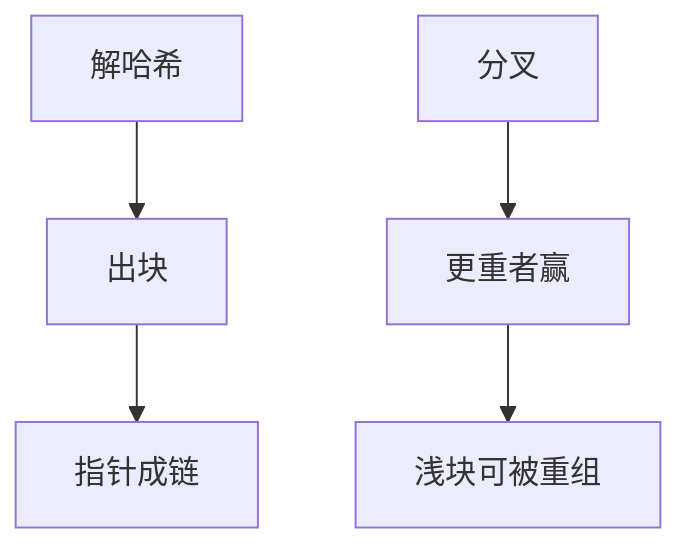

# PoW 与区块链共识直觉

开放成员里没有 $n$ 与 $f$ 的名册。工作量证明让出块权变贵，最长链是一种概率最终的全序，不是 Paxos 的多数派选定。

<footer>—— 据 Nakamoto, Bitcoin: A Peer-to-Peer Electronic Cash System, 2008；Lamport 拜占庭将军与 Castro PBFT 对照整理</footer>

上一课[etcd/Chubby](/cs/etcd-chubby)假定已知副本集。缺口是**许可名单不存在**时如何对日志达成序。本课只给计算机课需要的直觉：PoW 换了故障与同步假设，不把加密货币、交易所或限价簿写进来。共识单元在此封口。

## 问题

PBFT 要 $n=3f+1$ 且身份已知。开放网络身份可伪造（Sybil）。Nakamoto：出块须找哈希低于目标，期望耗时由难度调节。后继块指针形成树，客户端跟**累计工作最多**的链。重组：更长（更重）的链让浅块失去最终性——最终性是概率随深度指数降，不是多数派证书。

缺口：这不是[线性一致](/cs/linearizability)寄存器。读「最新块」可在分叉上。确认数是应用选的深度，不是 Herlihy–Wing 的线性化点。

2008 白皮书不是同行评审 TODS，但是 PoW 链的源头文献。Dwork–Naor 的定价邮件是 PoW 更早思想，点名。

## 方法

对照表（直觉，不证经济）：

| | Raft/PBFT | PoW 链 |
| 成员 | 已知 | 开放 |
| 安全阈值 | $f$ 相对 $n$ | 算力比例 |
| 最终性 | 提交后确定 | 深度概率 |
| 同步 | 部分同步活性 | 出块间隔相对传播延迟 |

不要把挖矿当[故障检测器](/cs/failure-detectors)。也不要把难度当 NTP。

## 机制

传播延迟若接近出块间隔，分叉率上升，安全性依赖「诚实算力多数」加足够慢的出块。这是同步味道的假设，与 FLP 异步确定共识不是同一格子。自私挖矿等攻击说明激励与算法缠在一起——本课点名，不写博弈全文。

许可链用 PBFT 族更常见：成员又回来了。PoW 的课程序列价值是：共识不一定长成 prepare/accept。数据中心有名册时，用 Raft 比用 PoW 更符合故障模型。

本课不写智能合约、不写 Transformer、不写 LOB。

## 边界

本课不分析奖励函数，不引入权益证明细节。不给投资建议。后课系统模式从 RPC 开始，默认仍在数据中心崩溃模型；只有需要开放成员全序时才回想到 PoW 的概率最终。

有名册，用法定人数。无名册，用昂贵的出块权加概率深度。不要把后者的话术套到 etcd。

## 小结

- PoW 抗 Sybil：出块耗能，最长（最重）链排序。
- 最终性是深度上的概率，不是多数派证书。
- 已知成员的数据中心协调仍用 Raft/Paxos/PBFT。
- 出处：Nakamoto, 2008；对照 Lamport BGP、Castro PBFT。
