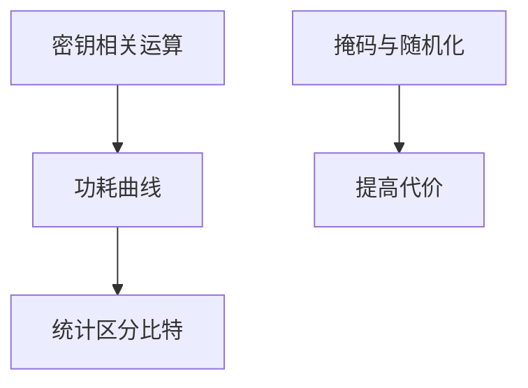

# 功耗分析 DPA

运算的功耗与数据相关时，统计多条曲线就能抽出密钥比特。防护是掩码、随机化与恒定功耗设计，而不是把算法换成「更长的密钥」一句话。

<footer>—— Kocher, Jaffe and Jun, Differential Power Analysis, CRYPTO 1999</footer>

## 定位

上一课[固件](/cs/firmware-security)还在逻辑更新。缺口是**物理可观测**：功耗。主干侧信道已给时间；本课 DPA。不给采集与分析步骤。

后课默认已经读完本课钉下的合同，只补差，不从该领域第一性原理重开。

## 问题

智能卡、安全元件在敌手手上。简单功耗与差分功耗。缺口是实现对策：掩码、隐藏、随机延迟——代价是性能与随机数质量。

### 实验室模型

课程只要求把功耗标进威胁模型。不指导搭建探针。

Kocher et al. 1999。禁止 DPA 实验指导。故障注入下一课是主动物理。

## 方法

陈述相关泄漏。对策分层。下一课故障注入。

图中节点是本课的机制骨架；课程不把图展开成可运行的攻击步骤。

## 机制

物理 C 泄漏。故障下一课主动改计算。

前提写进合同之后，游戏外的误用只当失败模式点名，不在本课写成操作程序。

## 边界

不写探针实验。故障注入下一课。

## 小结

- 固件逻辑之后，功耗把数据变成曲线。
- DPA 是统计侧信道；对策是掩码与隐藏。
- 密钥加长不自动关功耗泄漏。
- 下一课故障注入。
- 出处：Kocher, Jaffe and Jun, 1999。
