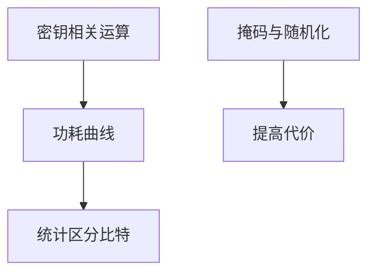

# 功耗分析 DPA

运算的功耗与数据相关时，统计多条曲线就能抽出密钥比特。防护是掩码、随机化与恒定功耗设计，而不是把算法换成「更长的密钥」一句话。

<footer>—— Kocher, Jaffe and Jun, Differential Power Analysis, CRYPTO 1999</footer>

上一课[固件](/cs/firmware-security)还在逻辑更新层面，缺口降到**物理可观测**：功耗。主干侧信道已给时间；本课 DPA。不给采集与分析步骤。

后课默认已经读完本课钉下的合同，只补差，不从该领域第一性原理重开。

## 问题

智能卡、安全元件一旦落到敌手手上，密码算法就只在他的示波器里运行：门电路翻转时充放电，瞬时功耗与翻转的比特相关，而翻转的比特由密钥决定。SPA 读单条曲线，直接看出模幂的平方/乘法序列这类结构；DPA 更进一步：采集多条曲线，按「猜某密钥比特为 1 或 0」分组取均值，猜对时两组在泄漏点出现可统计区分的差值，猜错只剩噪声。因此密钥加长不自动有效——泄漏是逐比特的。缺口是实现对策：掩码把中间值拆成随机份额、隐藏让功耗与数据无关、随机延迟打散对齐——代价是性能与随机数质量。

### 实验室模型

课程只要求把功耗标进威胁模型：发出去的设备按「敌手可长期物理接触」评估，而不是只按网络攻击评估。不指导搭建探针。

Kocher et al. 1999。禁止 DPA 实验指导。故障注入下一课是主动物理。

## 方法

把泄漏与对策对应着陈述：哪类运算泄漏——查表、模乘、比较器；哪层对策接——算法层掩码、电路层隐藏、协议层限速与随机化。两者的失败模式不同：掩码怕随机数质量差或份额被单点攻破，隐藏怕工艺偏差让「恒定功耗」假设不成立。下一课故障注入。

```mermaid
flowchart TD
  OP["密钥相关运算"] --> PWR["功耗曲线"]
  PWR --> STAT["统计区分比特"]
  MASK["掩码与随机化"] --> HARD["提高代价"]
```

## 机制

物理层把条件熵泄漏出去：密钥的条件熵随观测次数单调下降，DPA 的分组平均正是把单条曲线里低于噪声的信号累加出来——每条曲线一点微小偏差，上万条叠加就成了清晰峰值。防护核心因此不是「藏住算法」，而是压低每次运算与数据的相关性。与下一课对照：故障注入是主动改计算，DPA 是被动听计算。

## 边界

不写探针实验，不评估具体芯片的抗性等级——离开受控实验室这些数字无意义。故障注入下一课。

## 小结

- 固件逻辑之后，功耗把数据变成曲线。
- DPA 是统计侧信道；对策是掩码与隐藏。
- 密钥加长不自动关功耗泄漏。
- 下一课故障注入。
- 出处：Kocher, Jaffe and Jun, 1999。
