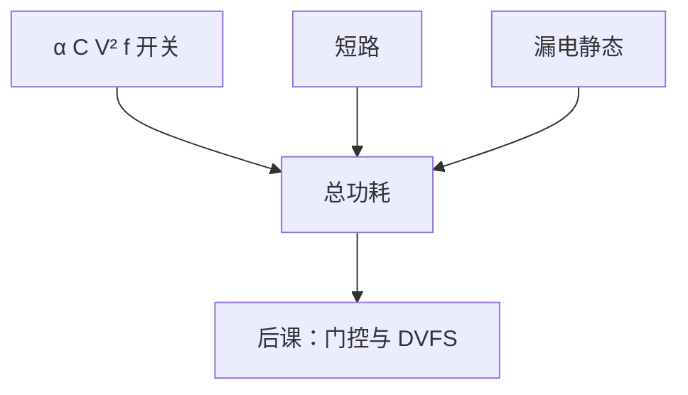

# 功耗：动态与静态

  
动态功耗随 $CV^2f$ 与翻转率走；静态是漏电，关断时钟也还在漏。算术单元的华莱士树既贡献电容，也贡献每拍翻转。

  <footer>—— 据 Rabaey, Chandrakasan, Nikolic, Digital Integrated Circuits；Weste and Harris, CMOS VLSI Design；Hennessy and Patterson, CA:AQA 整理</footer>

[上一课](/cs/asic-flow-stdcell)让网表落到带电容的金属与扩散区。[STA](/cs/sta) 只管时序。缺口是**功耗分解**：动态（开关、短路）与静态（亚阈值、栅漏），否则下一课门控与 DVFS 没有作用对象。

## 问题

CMOS 动态：$P_{\mathrm{dyn}}\approx \alpha C V^2 f$。$\alpha$ 是活动因子，FMA 阵列每拍大翻转则 $\alpha$ 高。短路功耗在边沿转换时 PMOS/NMOS 同时导通。静态：沟道漏电随阈值与温度，工艺缩小后可与动态同量级。缺口不是再讲标准单元行，而是这几项如何进设计决策：降 $V$ 最有效，但延迟变差，STA 要重做。

FPGA LUT 配置 SRAM 也漏电；ASIC 标准单元按阈值分 HVT/LVT 库做漏电–速度权衡。

### 降频不是唯一旋钮

$P\propto f$ 只抓住动态。漏电与 $f$ 无关，待机芯片仍热。把功耗问题全交给「时钟调慢」，静态主导的节点无效。面积更大的并行（多份 ALU）可降 $f$ 保持吞吐，但 $C$ 上升，需要算总账——阿姆达尔与功耗墙后课再收。

Rabaey DIC 与 Weste/Harris 给 CMOS 功耗公式。CA:AQA 把功耗作为体系结构约束。本课不进入电源管理 IC 的模拟设计。

## 方法

估计：从 RTL/网表切换活动（仿真或向量）× 电容模型。时钟网本身是巨大 $C$，故 [CTS](/cs/clock-skew-cts) 也是功耗问题。算术：饱和 MUX 比浮点 LZC 轻；双精度 FMA 是功耗大户。报告分开关、内部、漏电。

温度反馈：更热则漏电更大，STA 的慢角与功耗的热角要一起看。

## 机制

下一课时钟门控降 $\alpha$ 中的时钟翻转；DVFS 降 $V$ 与 $f$。Dennard 缩放解释为何电压不能随工艺无限降。本课只钉两项之和。验证与 DFT 扫描时翻转率异常高，功耗签核要分功能模式与测试模式。

## 边界

本课不推导亚阈值电流公式的全部器件物理，不写封装热阻网络的有限元。不把数据中心电费表当课程。不进入限价簿或模型训练的能源口号，只谈芯片上的 $C,V,f$。

后课默认：动态随 $CV^2f\alpha$，静态是漏电；二者都要管。

## 小结

- 动态：$CV^2f$ 与翻转；静态：漏电，与时钟无关。
- 降压最有效但伤时序。
- 时钟树与宽算术阵列是电容大户。
- 出处：Rabaey et al.；Weste and Harris；Hennessy and Patterson, CA:AQA。
