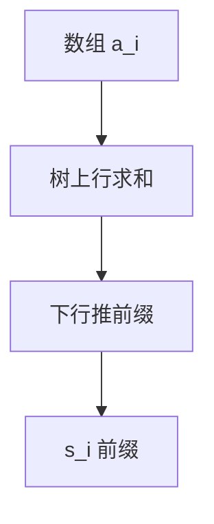

# PRAM 与前缀和

共享内存并行：前缀和 $n$ 个数用 $O(\log n)$ 时间、$O(n)$ 工作，是扫描、紧凑、链表的公共子程序。

<footer>—— 据 Ladner and Fischer, Parallel Prefix Computation, 1980；JáJá, An Introduction to Parallel Algorithms 整理</footer>

上一课[外存 I/O](/cs/external-memory-model)是层次。PRAM：多处理器同步共享 RAM。缺口是前缀（scan）：$s_i=a_1+\cdots+a_i$。串行 $O(n)$。并行：树上升下降 $O(\log n)$ 步。不重写 I/O 排序。后课 work-span。CREW/CRCW 点名。

## 问题

平衡二叉树：内部点存区间和，再向下推前缀。工作 $O(n)$，跨度 $O(\log n)$。链表前缀要用指针跳跃（Wyllie）或随机。CRCW 可更快但模型强。

缺口是前缀，不是 GPU 编程课。

### 不是 MapReduce 语义

PRAM 同步共享内存。MapReduce 是数据并行另一模型。不要混。

Ladner–Fischer 1980。Blelloch scan。后课 work-span 把 PRAM 界翻译成 fork-join。

## 方法

数组树两遍。应用：过滤（紧凑）、词法分析、括号匹配并行点名。

结合律运算即可（$\min$、$\times$）。

## 机制

区间结合律使树正确。工作 = 总运算，跨度 = 依赖长链。与快速幂：都是树形结合，一个并行一层、一个串行平方。与 FFT：蝶形也是 $\log n$ 层。

## 边界

本课不写 EREW 最优常数。不写 MPI 网络。后课默认：前缀和 $O(\log n)$ 跨度、$O(n)$ 工作。下一课 work-span 与 fork-join。

## 小结

- 前缀和是并行扫描原语。
- $O(\log n)$ 时间、$O(n)$ 工作。
- 结合律即可。
- 出处：Ladner and Fischer, 1980。
