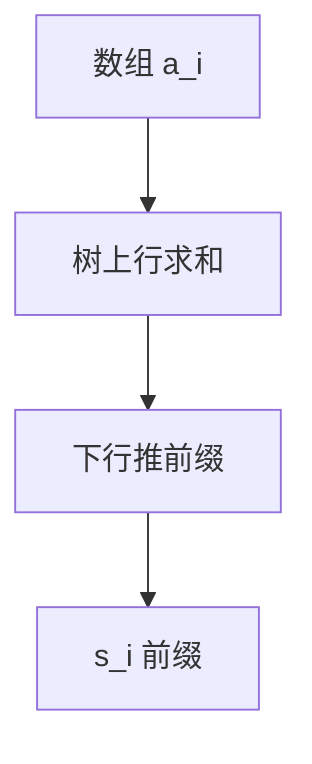

# PRAM 与前缀和

共享内存并行：前缀和 $n$ 个数用 $O(\log n)$ 时间、$O(n)$ 工作，是扫描、紧凑、链表的公共子程序。

<footer>—— 据 Ladner and Fischer, Parallel Prefix Computation, 1980；JáJá, An Introduction to Parallel Algorithms 整理</footer>

上一课[外存 I/O](/cs/external-memory-model)换的是存储层次这个成本维度；本课换并行度。PRAM 是最朴素的并行模型：多处理器同步地在共享 RAM 上执行指令。缺口是前缀（scan）$s_i=a_1+\cdots+a_i$——串行一遍 $O(n)$，看似天生串行，实则树形两遍只要 $O(\log n)$ 步。本课不重写 I/O 排序；后课 work-span 才给并行成本记账，CREW/CRCW 变体点名即可。

## 问题

在数组上造一棵平衡二叉树：上升遍求每个内部结点的区间和，下降遍把父结点积攒的左侧和往下推加，两遍各 $O(\log n)$ 跨度、总工作 $O(n)$。链表没有下标，前缀要先指针跳跃（Wyllie 的路径倍增）或随机化重排成数组。CRCW 允许同拍并发写时还能更快，但那是在用更强的模型换结果。

缺口是前缀这个原语本身，不是 GPU 编程课。

### 不是 MapReduce 语义

PRAM 是同步共享内存，每步所有处理器齐步走；MapReduce 是另一套数据并行模型，靠无共享机器间的分布式洗牌。两者的成本记账不能混用。

Ladner–Fischer 1980。Blelloch scan。后课 work-span 把 PRAM 界翻译成 fork-join。

## 方法

方法就是数组上的树两遍：上升、下降。有了 scan，一大批看似串行的应用立刻并行化——过滤（按谓词得 0/1 再排他 scan 算新下标，即紧凑）、并行词法分析、括号匹配——点名即可。

```mermaid
flowchart TD
  A["数组 a_i"] --> UP["树上行求和"]
  UP --> DN["下行推前缀"]
  DN --> S["s_i 前缀"]
```

树形两遍只用到结合律：$\min$、$\times$ 等任何满足结合的运算都能代入，不必可交换。

## 机制

树形分解为什么对：结合律允许把区间任意切分再组合，内部结点的和与计算顺序无关。工作等于总运算次数，跨度等于依赖链的最长路径——上升、下降各贡献一段长 $\log n$ 的链。与快速幂同构：都是树形结合，快速幂用平方把指数对折，串行里一层一个平方；FFT 的蝶形网络同样是 $\log n$ 层的树形依赖。

## 边界

本课不追 EREW 下常数的最优实现，不写 MPI 这类网络模型。后课默认：前缀和 $O(\log n)$ 跨度、$O(n)$ 工作。下一课 work-span 与 fork-join。

## 小结

- 前缀和是并行扫描原语。
- $O(\log n)$ 时间、$O(n)$ 工作。
- 结合律即可。
- 出处：Ladner and Fischer, 1980。
