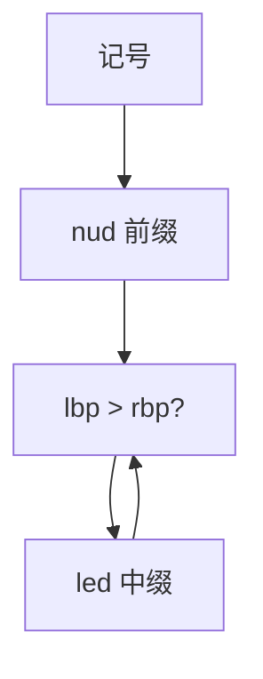

# Pratt 算符优先

每个记号一个左约束力与一个 nud/led 函数；解析表达式不必为每一优先级写一层非终结符。

<footer>—— 据 Pratt, Top Down Operator Precedence, 1973；对照龙书的算符优先与表达式文法整理</footer>

上一课[PEG](/cs/peg-packrat)用有序选择能写表达式，但左结合与多层优先级会把规则写成楼梯，左递归还要改。主干 CFG 用分层 `E → E + T | T`。缺口是**Pratt**：一张算符表，递归下降只留一个 `parseExpression(rbp)`。本课钉 nud/led 与绑定力，不把整门语言都改成 Pratt。

## 问题

LL 分层文法正确但冗长；PEG 长枝优先要小心。Pratt：前缀记号提供 `nud`（null denotation），中缀/后缀提供 `led`（left denotation）。当前约束力 `lbp` 大于调用者的 `rbp` 则继续吃中缀。缺口是这份**按记号分派的表达式分析**，不是再算 FIRST。

数字、标识符、`(` 走 nud；`+` `*` `.` `(`（调用）走 led。一元 `-` 与二元 `-` 用同一 lexeme、不同 nud/led。

### 绑定力不是 LALR 的 `%left`

`%left` 改的是冲突格；Pratt 的数字是手写下降的循环条件。二者可对齐同一张优先级表，算法不是同一份自动机。

Pratt 1973（POPL）。Vaughan Pratt 的「自上而下算符优先」被后来的 JS 引擎与教材反复实现。龙书另有算符优先分析（自底向上），名称相近、栈不同，本课不混。

## 方法

`parse(rbp)`：读一个记号，调 `nud` 得左值；当下一记号 `lbp > rbp` 则调其 `led(左值)`。右结合：`led` 里用 `lbp-1` 递归。调用与下标是 led，左值已是 callee 或数组。

与 lex 对接：词法仍负责最长匹配；Pratt 只看种别。不要在 Pratt 里解析类型声明的全部括号歧义——那是 C 的声明语法，不是表达式。

## 机制

复杂度对表达式结点线性。错误：nud 表空则非法开头。与递归下降的其余语句（`if`、块）并列：语句用下降，表达式切 Pratt，是常见手写前端。

PEG 的表达式规则可生成 Pratt，或直接写循环；本课强调人可维护的一张表。二义在 Pratt 里被表消掉：不会同时返回两棵树。

## 边界

本课不处理增量，不把声明符（C `int (*p)()`）硬塞进 Pratt。后课默认：表达式可用算符表下降；语句级错误恢复下一课。下一课：分析失败之后如何跳过、同步。

龙书的算符优先（Floyd）是另一算法，点名对照即可，不在本课实现。

## 小结

- Pratt：nud/led + 左右约束力，一张表吃表达式。
- 右结合用略小的 rbp 递归。
- 与 CFG 分层、PEG 楼梯、LALR `%left` 对齐的是优先级数字，不是同一自动机。
- 出处：Pratt, 1973；对照 Aho et al. 算符优先章。
