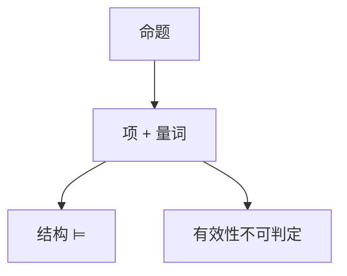

# 谓词逻辑与量词

一阶逻辑把原子换成关系与函数，加上 $\forall,\exists$。有效式可半判定，不可判定；有限模型上又回到 SAT 的亲戚。

<footer>—— 据 Enderton；Church, 1936；Turing, 1936 整理</footer>

上一课[命题与范式](/cs/propositional-logic-cnf) 的赋值是有限 $2^n$。缺口是**一阶**：论域可无限，量词绑定变元。程序规范「对所有输入」落在这里。本课钉语法、结构、满足，以及 Church 不可判定；自然演绎下一课。

## 问题

语言：函数符、谓词符、等号。项、原子、公式。结构 $\mathfrak{M}$：论域 $|\mathfrak{M}|$，解释符号。赋值把自由变元映到论域。$\mathfrak{M}\models\varphi$ 闭式为真。有效：一切结构为真。命题是一阶的无量词、无函数的碎片。

有效性 RE 完全（完备性给半判定：能证则有效，且可枚举证明）。不可判定：把 TM 停机编成句子（Church–Turing）。有限模型上，一阶句子的有限可满足仍不可判定（Trakhtenbrot），点名。

### 不是「英语的所有 / 存在」

量词论域由结构指定，不是宇宙中的一切东西。换结构，同一句子真值可翻。绑定与 λ 课的捕获同一卫生问题。

Enderton 一阶章。Church 1936 判定问题。Gödel 完备性（下一课可靠完备的一阶版）。本课不进二阶逻辑。

## 方法

写 $\forall x\exists y\ R(x,y)$ 在自然数后继与在有限图上的不同。Skolem：$\forall x\exists y$ 换成函数 $f(x)$，等可满足。Prenex 点名。不要把 Prolog 当定义。

## 机制

Hoare 逻辑的断言语言需要量词谈数组全体下标。SMT 把一阶碎片（算术、数组）交给判定器——可判定理论是特例，不是本课的完全一阶。本课先承认一般一阶太宽。

Herbrand：无等式时，可满足性与基项上的命题可满足相关，给 SMT 实例化埋伏。

自由变元必须在结构里赋值才有真值；闭式才谈 $\mathfrak{M}\models\varphi$。空论域约定因系统而异，本课默认非空。二阶量词可谈「存在性质」，表达力骤升、证明论不同。Trakhtenbrot：有限可满足不可判定，故「只关心有限模型」帮不掉一般一阶。

## 边界

本课不证完备性，不写公理表。不引入集合论公理化。后课默认：规范写成一阶公式相对某结构；有效性不可判定。下一课证明系统：自然演绎。

有效性可半判定（枚举证明）但不可判定。程序规范里的「对所有输入」是一阶句子相对某结构，不是英语全称。SMT 后课只占领可判定碎片，不收回本课的否定结果。

上一课留下的缺口在本课收口；「谓词逻辑与量词」进入后课词汇表后只引用。文献用来钉对象与边界，不把本课写成该主题的独立综述。

## 小结

- 一阶：结构解释函数与关系；量词在论域上走。
- 有效可半判定、不可判定。
- 命题是无量词碎片；程序规范需要量词。
- 出处：Enderton；Church, 1936。
