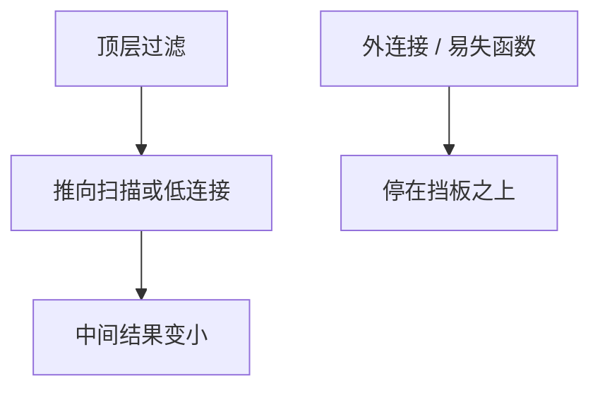

# 谓词下推

能在扫描或第一次连接前就丢掉的行，不要拖到树顶再过滤；下推是改写里最常用的一条。

<footer>—— 据 Ullman 对选择下推；Chaudhuri；Ramakrishnan and Gehrke</footer>

[上一课](/cs/query-rewrite)说先用代数律把树变瘦。本课不重列结合律。缺口是那一课最重要的实例：把 `WHERE`/`HAVING` 能下到的谓词推向叶子或更低的连接，使中间基数按[直方图](/cs/histogram-card)变小。外连接与相关子查询会挡住部分下推。

## 问题

查询改写留下「下推与结合」。若优化器只交换连接顺序、不把选择贴到扫描，索引与堆扫描仍读全集。谓词下推：选择穿过投影（保留需要的列）、穿过内连接。缺口是**这一条律的机制与挡板**，不是代价搜索本身。

下推到存储引擎（仅读需要的列与行）是同一思想的物理版。易失函数、随机() 不能无约束下推。

## 方法

从树顶收集合取项，按引用的属性集合贴到最深仍合法的节点。不能穿过改变 NULL 填充的外连接侧。物化视图匹配是另一类改写，后课视图。本课不把全部 IDB 规则写成 Datalog 教材。

## 机制

下推直接兑现[选择投影连接的顺序](/cs/algebra-reorder)里画过的那棵瘦树。物理上，叶子扫描可以变成索引条件。语义在内连接与无 NULL 坑时与原 SQL 一致；挡板存在是为了不把 unknown 变成错行。

## 边界

本课不把谓词下推到另一台分片节点的网络协议写完（后课分片）。模式太宽导致的更新异常，下一课范式。

后课默认：过滤尽量靠近数据。表太宽是设计问题，不是再下推一次能修好。

## 小结

- 选择尽量下推以减小中间结果。
- 外连接与易失性是挡板。
- 范式与分解下一课。
- 出处：Ullman；Chaudhuri；Ramakrishnan and Gehrke。
