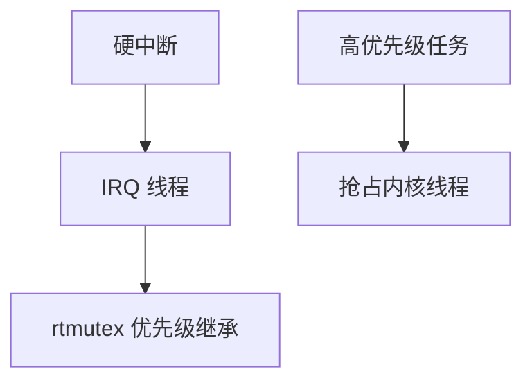

# PREEMPT_RT

PREEMPT_RT 把大多数内核自旋锁换成可睡眠的 rtmutex，中断线程化，使优先级高的任务能在有界时间内抢到 CPU。

<footer>—— 据 Linux PREEMPT_RT 文档；Rostedt 对实时抢占的论述；McKusick 对内核抢占的背景</footer>

[DEADLINE](/cs/sched-deadline) 假定内核别关抢占太久。[内核抢占](/cs/kernel-preempt) 主干有程度。缺口是 **RT 补丁主线化的机制**：锁、IRQ 线程、延迟来源。

## 问题

普通内核：持 spinlock 关抢占，软中断可拖延用户 RT。PREEMPT_RT：`raw_spinlock` 才真关；多数锁可被抢。IRQ：默认线程化，按优先级跑。缺口：仍有不可抢占段（关中断、硬件）；优先级继承防 [优先级反转](/cs/priority-inversion)。本课不把每把锁的转换表列出。

cyclictest 测的就是这些段的尾巴。对象是延迟上界的工程近似，不是形式证明。

## 方法

配置 `PREEMPT_RT`。自旋改睡眠 → 可调度。对照 [NAPI](/cs/napi)：收包可在线程上下文，延迟与吞吐折中。对照 [KPTI](/cs/kpti-os)：陷入税仍在，RT 更敏感。对照 DPDK：旁路不靠内核抢占。

## 机制

RT 内核把「内核是一个大临界区」拆开，使 SCHED_FIFO/DEADLINE 的延迟从毫秒级可降到数十微秒级（视硬件）。吞吐与调试性下降。不要写成保证书。与 [dma](/cs/dma-coherence)：完成 IRQ 仍可能是 raw 路径。

驱动质量决定上界：一个关中断的驱动毁整机 RT。

实现上：raw_spinlock 仍关抢占，驱动若误用会毁延迟上界。中断线程的优先级要高于用户 RT 才有意义。打印与 ATA 复位仍是著名长段。 读法上只引用[上一课](/cs/sched-deadline)的结论，不把对象换成训练推理或限价簿。

本课在操作系统进阶的「调度进阶 / 公平、实时与能耗」课序里，对象是 **PREEMPT_RT**。

- 先修只引用，不重导：上一课的结论当公理，本课只补差。
- 五栏不吞并：不把本课写成大模型训练/推理，也不写成限价簿或权重量化。
- 文献用 OSTEP、McKusick、内核文档与具名会议论文；不发明 arXiv 编号。

## 边界

本课不引入 xenomai 双内核。不保证云虚拟机的 RT 数字。下一课如何量延迟：cyclictest。

版本字段会变，课序钉的是机制对象「PREEMPT_RT」，不是某一主线内核的结构体名。
后课默认：内核可配置为深度抢占。用 cyclictest 看延迟分布，下一课。

## 小结

- PREEMPT_RT：可抢占锁 + 中断线程化 + PI。
- 仍有不可抢占硬件段。
- 延迟测量是下一课。
- 出处：PREEMPT_RT；Rostedt；Linux RT 文档。
