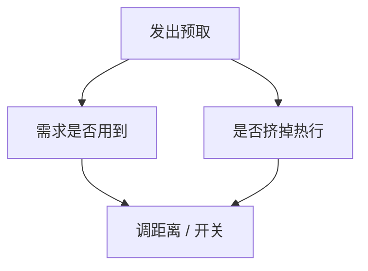

# 预取时机与污染

太早：块被踢走，预取白做；太晚：需求 load 仍付缺失；猜错：热行被挤掉，DRAM 带宽还给别人用。

<footer>—— 据 Srinath et al., Feedback Directed Prefetching, MICRO 2007；Hennessy and Patterson, CA:AQA 整理</footer>

[上一课](/cs/stride-stream-prefetch) 会发 $addr+k\Delta$。$k$ 太大或流已经结束，就变成污染。[RRIP](/cs/rrip-dead-block) 给了插入位置，但没有说预取器何时该节流。本课不重检步长。缺口是**及时性与污染的度量，以及用反馈关掉或拉开预取。**

## 问题

覆盖率：需求 miss 里有多少本可被预取覆盖。准确率：发出的预取里有多少被真正用到。污染：因预取插入而导致的额外需求 miss。带宽：预取占用 DRAM 后，需求 miss 排队变长。四者打架。缺口不是再加一种 $\Delta$ 检测，而是**运行时看这四者，调 $k$ 或关掉该流。**

Feedback Directed Prefetching（FDP）用预取队列里「被需求命中 / 被替换前未用」等计数调节攻击性。许多 LLC 预取器带类似节流。

## 方法

每条预取带使用位：被需求 load 命中则记成功；被替换时仍未用则记浪费。污染：给被预取踢掉的行记「若还在则会命中」的近似（如 victim 里短期命中）。反馈：准确率低则增大插入 RRPV（更容易被踢）或减小 $k$；污染高则抑制该 PC 的预取。

软件预取同样可污染；编译器插入密度过高时，硬件反馈仍适用，或 OS 关硬件预取。

## 机制

[MLP](/cs/mlp-memory-parallelism) 的 MSHR 是共享资源：错预取不仅污染 SRAM，还堵住真缺失的登记。及时性与 DRAM 调度互动：同一 bank 上提前太多会造成行缓冲颠簸。这些不改 ISA，只改 CPI 的访存项。

与一致性：预取读可能把行变成 S，干扰他核的 M——多核下预取攻击性更要收敛。分区课会再把带宽和命中分到 QoS 里。

## 边界

本课不引入指针追逐的依赖预取器细节。也不把「预取指令作为侧信道」写成攻击教程；机制上预取会改 cache 状态，安全课会用到，这里只记副作用存在。下一课把 cache 容量本身按核切开。

后课默认：预取必须带反馈；默认攻击性不是最优。多核共享 LLC 时，还要按核或按类别切容量。

## 小结

- 预取看覆盖、准确、污染、带宽四项，用反馈调 $k$。
- 错预取占用 MSHR 与一致性状态。
- 共享 cache 如何按核切开，是下一课分区。
- 出处：Srinath et al., *MICRO*, 2007；Hennessy and Patterson, *CA:AQA*。
