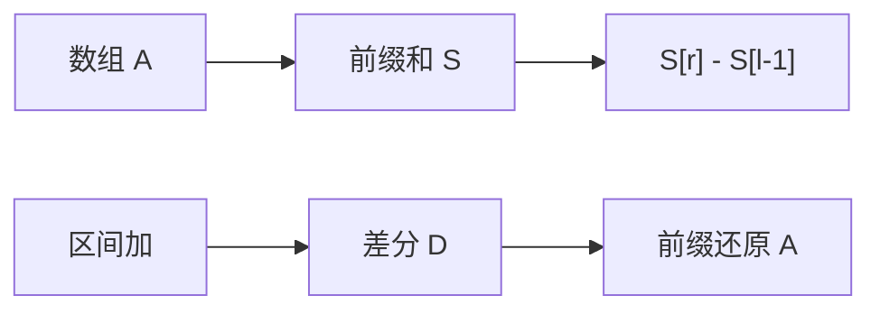

# 前缀和与差分

把每个位置改成「从左端扫到这里的合计」，区间和就变成两次查表相减；差分是它的逆运算，把区间加变成两端各改一次。

<footer>—— 据 Cormen, Leiserson, Rivest and Stein, Introduction to Algorithms；Sedgewick and Wayne, Algorithms 整理</footer>

[上一课](/cs/cache-side-channel)把微结构进阶收到 cache 组相联的副作用上。主干里[数组与随机访问](/cs/array-random-access)已经给出按下标 $\Theta(1)$ 读写，但没有把「一段连续下标的合计」收成预处理结构。本课起数据结构进阶：不重开推测执行，也不重讲地址公式。缺口是：静态数组上的区间和、以及区间加完再读点值——用前缀和与差分数组，而不是每次扫描。后课默认已经读完这里：静态区间和是 $O(1)$ 查询，$O(n)$ 预处理。

## 问题

$n$ 元数组 $A$，多次问 $\sum_{i=l}^{r} A[i]$。每次扫 $[l,r]$ 是 $\Theta(r-l+1)$，查询多了不可接受。缺口不是新的存储模型，而是**一次从左到右的合计表** $S[i]=\sum_{j=1}^{i}A[j]$（$S[0]=0$），使

$$
\sum_{i=l}^{r} A[i] = S[r]-S[l-1].
$$

对偶问题：多次对 $[l,r]$ 同时加 $d$，最后读每个点。若每次把区间扫一遍，总代价随更新长度涨。差分 $D[1]=A[1]$，$D[i]=A[i]-A[i-1]$（$i>1$）把区间加变成 $D[l]\mathrel{+}=d$、$D[r+1]\mathrel{-}=d$，再前缀和还原 $A$。

前缀和是扫描的记录；差分是离散导数。二维前缀和（容斥四角）同构，本课先钉一维，后课线段树再谈可变数组。

## 方法

预处理：从左扫一遍写 $S$，时间 $\Theta(n)$，额外 $\Theta(n)$ 字。查询两次随机访问。差分更新：合法下标上两次写；全部更新结束后对 $D$ 做一次前缀和得到最终 $A$。不要在「尚未还原」的 $D$ 上直接当点值用，除非合同写明读的是差分数组本身。

与[摊还分析](/cs/amortized-analysis)无关：这里每次查询最坏已是 $\Theta(1)$，没有峰值要摊。

## 机制

正确性就是和的结合律与减法消去。下标约定必须全局一致：从 $0$ 还是从 $1$，以及空区间 $l>r$ 是否定义为 $0$。溢出：合计宽度要能装下 $n$ 倍元素上界，否则环绕会把区间和证伪。

差分与前缀互逆：对 $A$ 取差分再前缀，得到 $A$；对 $D$ 取前缀再差分，得到 $D$。区间加只动两端，是因为中间的差分不变——相邻差没变，整段被抬高同一常数。

顺序扫写 $S$ 吃[局部性](/cs/locality-principle)；查询两次随机读，cache 行为取决于 $l,r$ 是否跳。本课不把这当成外存 B 树问题。

## 边界

前缀和要求**可结合、有逆**的区间贡献（通常是加法群）。最大值、最大公因数没有群逆，不能靠两次查表相减得到任意区间——那是下一课稀疏表的入口。数组中途被单点改掉，$S$ 全表作废，需要树状数组或线段树，本课不提前写。

后课默认：静态加法区间用前缀和；静态幂等查询另找倍增表。

## 小结

- 前缀和：$O(n)$ 预处理，$O(1)$ 区间和。
- 差分：区间加变成两端点更新，再前缀还原。
- 需要群运算；无逆的聚合留给稀疏表。
- 出处：Cormen et al.；Sedgewick and Wayne。
