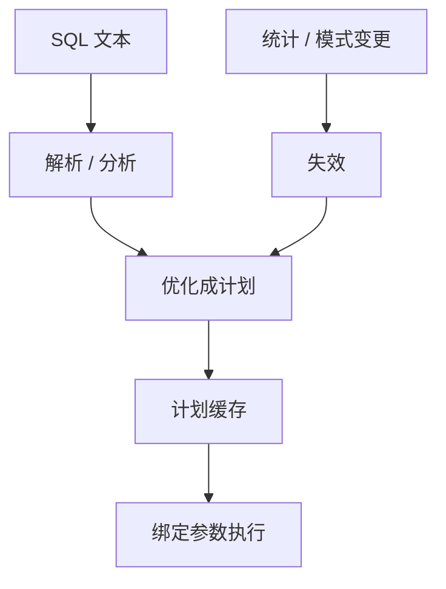

# 预编译与计划缓存

语句先解析、绑定类型、优化成计划；同一形状反复出现时，缓存计划摊掉优化，也可能把第一次的基数赌局锁死。

<footer>—— 据 Selinger et al. 优化在路径选择之前；Ramakrishnan and Gehrke；PostgreSQL / SQL 标准对 prepared statement 的整理</footer>

[上一课](/cs/connection-pooling)让同一后端反复服务请求。本课不调池大小。缺口是语句路径：文本 SQL 每次解析、分析、优化代价不低。预编译（prepared statement）把解析与（可选）计划钉在会话或全局缓存里，执行只传绑定参数。查询语言进阶在此收口，下一单元才回依赖理论。

## 问题

主干 [查询计划](/cs/query-plan) 假定一次优化。OLTP 同一条 `WHERE id = $1` 每秒成千上万次，重复优化浪费 CPU，也增加锁在解析器上的时间。预编译：`PREPARE` 得到句柄；`EXECUTE` 带参数。缺口是**计划是否在绑参数之前就定死**：参数未到时只能用平均选择率；第一次执行的参数若极特殊，缓存计划可能永远选错路径。

绑定窥视（bind peeking）：用第一次（或每次）参数再优化。通用计划：不看参数。两种策略在倾斜数据上行为相反。本课钉权衡，不把某一产品默认当理论。

SQL 注入：预编译把参数当数据不进解析器，是正确性与安全的同一机制。ORM 若退回拼字符串，池与预编译都救不了。

## 方法

客户端：参数化 API，禁止拼值。服务端：会话级准备语句，或全局计划缓存按文本+常量折叠后的形状索引。失效：统计更新、索引增减、模式版本（上一课迁移）必须丢缓存。

与存储过程：过程体内语句同样走缓存；过程本身是另一层句柄。本课不把二者当成一种对象。

## 机制

代价模型仍用 [直方图](/cs/histogram-card)。缓存命中跳过搜索，等于假设「形状不变则计划不变」。倾斜、数据涨一个数量级、参数从「一个 id」变成「半个表的范围」，假设破裂，表现为突然变慢——后课计划回归专门命名。本课只要求：缓存是性能合同，不是语义合同；结果应与每次重优化相同（忽略计划导致的超时差异）。

内存：每个缓存计划占解析树与算子树。无界缓存会胀。LRU 淘汰与池的后端寿命耦合。

## 边界

本课不讲 Selinger 动态规划如何搜连接顺序——那是下一单元第一课。也不讲学习型优化器。依赖理论单元从 Armstrong 公理重开模式侧，与本课执行侧分开。

后课默认：OLTP 用参数化语句；计划可缓存；统计与模式变必须能失效。查询语言进阶结束：聚合到计划缓存是「把 SQL 用完整」。

通用计划与窥视计划的选择，要按数据倾斜显式想，不能只开缓存开关。

## 小结

- 预编译分离解析/优化与执行；参数化同时防注入。
- 缓存计划摊优化，也可能锁死坏估计；统计变更要失效。
- 下一单元依赖理论：从 Armstrong 公理把主干范式课背后的推导补全。
- 出处：Selinger et al.；Ramakrishnan and Gehrke；SQL prepared statements。
