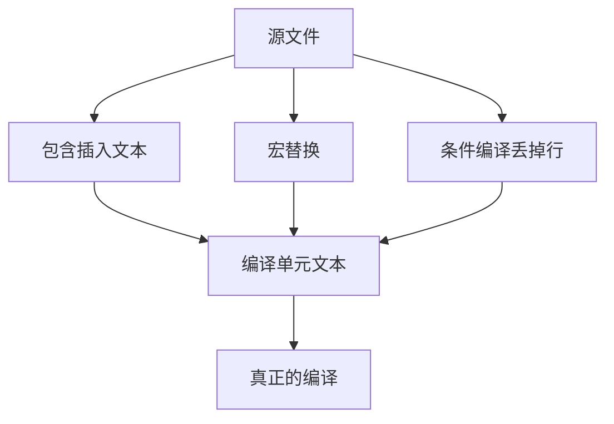

# 预处理器

编译器看见的不是你保存的那份源文件；它先经过一层按行工作的文本替换：包含、宏与条件编译。

<footer>—— 据 Kernighan & Ritchie, The C Programming Language, 2nd ed.；ISO/IEC 9899 整理</footer>

上一课[并发之前：共享可变](/cs/shared-mutable-preview)收束对象与运行时单元。本课不重讲别名，也不从构建图另起。缺口是：第一课已经把预处理画在编译之前，模块课已经依赖 `#include`——**这层文本机器具体做了什么，为何宏不是带类型的函数**。工具链单元从这里重新对准「源怎样变成编译单元」。

## 问题

预处理按翻译阶段工作：拼接行续、替换注释、执行指令、展开宏，得到一个编译单元文本。`#include` 是把另一文件插入此处；`#define` 把标识符换成替换列表；`#if` 按常量表达式丢掉一些行。缺口因此不是指令清单，而是**编译器类型检查发生在展开之后**。宏可以造出语法上合法、语义上与函数完全不同的代码：多次求值、缺少作用域、与优先级纠缠。

头文件守卫是条件编译的正当用途。用宏模拟「泛型」或内联，会把错误信息指到展开后的位置，调试器也难看清。后课真正的内联与 `static` 函数往往比函数式宏更安全。本课只钉文本替换模型，细节宏卫生留给专门的加深课。

### 宏不是内联函数

函数有类型、有一次求值、有作用域。函数式宏只是替换：`SQUARE(x++)` 会把 `x++` 写进文本两次。括号可以减轻优先级问题，不能恢复求值次数。`inline` 函数在语言里仍是函数，预处理完毕之后才存在。把 `#define` 当优化开关，会把契约从类型系统里抽走。

K&R 附录与正文都把预处理器写成独立语言。ISO C 规定翻译阶段：宏展开在句法分析之前。本课不把实现定义的 `#pragma` 当主干。

## 方法

包含路径由编译器驱动与构建系统提供，头文件用引号与尖括号区分查找起点。宏分对象宏与函数式宏；`#` 与 `##` 做字符串化与拼接，只在宏替换里有意义。条件编译用 `defined` 测试宏是否存在，常用来切平台——切得过多会把一份源变成许多份程序，测试课的规格会跟着分裂。

调试预处理问题的第一刀是看展开后的单元（编译器提供对应开关），而不是猜宏。这与第一课「不要把编译当黑盒」是同一习惯，只是黑盒更靠前一层。

`#include` 的查找顺序把构建选项变成文本内容的一部分：同一 `#include <foo.h>` 可以插进两份不同的声明，链接期只看见符号名。这是头文件纪律必须配合 `-I` 路径的原因。宏展开可以跨很多层，调试器停在源行上时，实际执行的是展开后的表达式，变量名可能根本不存在。把常量写成对象宏可以，但枚举或 `static const` 更有类型。后课断点要对准编译器真正吃进去的那份单元，必要时先看预处理输出。

## 机制

因为替换发生在语法之前，宏可以生成声明、花括号甚至不完整的片段。这使它强大，也使契约无法被函数边界课那种签名表达。链接器看不见宏：宏不产生符号，只影响各单元里最终出现的函数与对象。跨单元共享的应当是函数与类型，把逻辑放进宏会导致每个包含者各展开一份，体积与语义分叉。

条件编译把一份源切成多份程序：测试在主机宏下绿，不表示目标宏下同一契约成立。构建系统必须把这些宏当成图的输入，否则增量构建会留下用旧宏编出来的 `.o`。宏卫生（参数加括号、避免求值两次）是文本层的契约，类型系统看不见。头文件里的函数式宏会进入所有包含者，错误信息跨文件，调试符号对不上宏行——这是后课断点要对准「展开后的单元」的原因之一。能写成 `static` 函数的，不要用宏。

## 边界

本课不穷尽预定义宏列表，不讲实现把 `__FILE__` 怎样展开进断言。下一课[调试器与断点](/cs/debugger-breakpoint)假定已经有一份编译后的机器码与符号。后课默认：编译器输入是预处理后的单元；宏是文本，不是函数；头文件包含是插入，不是模块导入。

`#define` 没有作用域：从定义点到文件结束或 `#undef`，它会改写后续所有同名标识符，包括不该被动的局部变量名。这是文本层的别名，类型系统看不见。能用函数的地方不要用函数式宏。

## 小结

- 预处理做包含、宏与条件编译，发生在类型检查之前。
- 宏会重复求值、丢失类型；函数不能用 `#define` 代替。
- 头文件守卫是条件编译的正当用法。
- 下一课在展开并编译之后的机器码上设断点。
- 出处：K&R 预处理器；ISO C 翻译阶段。
