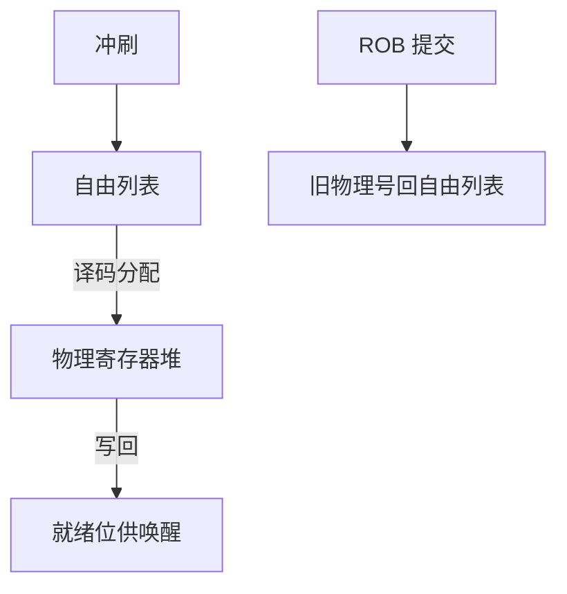

# 物理寄存器堆与释放

物理寄存器堆的端口和项数卡住窗口；自由列表空了，前端即使预测对了也分配不出目的槽，只能停取。

<footer>—— 据 Palacharla, Jouppi, and Smith, Complexity-Effective Superscalar Processors, ISCA 1997；Hennessy and Patterson, CA:AQA 整理</footer>

[上一课](/cs/register-renaming)规定每次写从自由列表取一个物理号。本课不重讲 RAT 查找。缺口是：**物理寄存器何时回到自由列表、堆要多少读/写口、以及窗口被「槽耗尽」卡住与被 ROB 满卡住有何不同。**

## 问题

物理寄存器不能在年轻指令写回时立刻释放：更年长的读者可能还没读，误预测还可能把 RAT 拨回这个槽。若等 ROB 提交才释放被覆盖的旧映射，则每个未提交写占一个槽，窗口上限 ≈ 物理数 − 架构寄存器数。槽不够时，即使发射队列空、功能单元闲，前端也要停。缺口不是再发明一种重命名，而是**把生命周期钉在提交点上**。

有的设计把结果先写 ROB 再在提交时搬进较小的架构堆（未来文件/ROB 数据），物理堆可以更小，但提交带宽变成搬移。当代宽核多半直接用大物理堆。

## 方法

自由列表：FIFO 或位图，每拍按译码宽度弹出目的寄存器。提交 $W$ 条时，把各条 ROB 项里「被覆盖的旧物理号」推进自由列表。误预测：检查点里的自由列表头尾指针（或位图快照）一并恢复，已经分给冲刷路径的槽回到空闲。

PRF 读口：每拍发射宽度 × 每指令源数；写口：写回宽度。端口不够就复制 bank 或错开写回，这是面积与频率交易，见 Palacharla 对「复杂发射」的警告。

## 机制

三项结构同时限制 ILP：ROB 项、物理寄存器、发射队列槽。释放纪律保证：一个物理号在 RAT 或某条未提交指令的源字段里时，绝不会出现在自由列表。x0 / 立即数没有目的槽。

向量/FP 另有一套 PRF，端口与宽度不同；本课只要求整数堆与前端同宽分配。SIMD 扩展的重命名在 ISA 对照课已经有寄存器名，本课不重写向量 ISA。

## 边界

本课不把发射队列的唤醒矩阵画完，那是下一课。也不处理 store 数据的物理寄存器：store 的数据源同样是物理号，但释放仍跟在提交之后，且要等 LSQ 确认。物理堆的 ECC 与检查点面积是可靠性课的接口，这里只承认「快照很贵」。

后课默认：分配与释放以 ROB 提交为界；前端停顿的一个合法原因是自由列表空。就绪的物理号如何被选进 ALU，靠发射队列。

## 小结

- 物理寄存器在覆盖者提交后才释放；误预测恢复自由列表。
- 窗口可能被 PRF 而不是 ROB 先耗尽。
- 唤醒与选择逻辑是下一课发射队列。
- 出处：Palacharla, Jouppi, Smith, *ISCA*, 1997；Hennessy and Patterson, *CA:AQA*。
