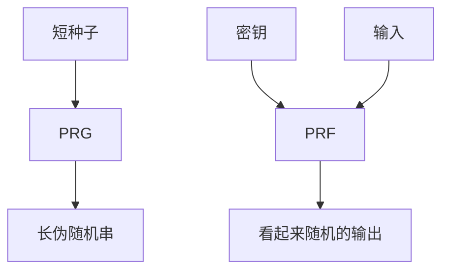

# PRG 与 PRF

伪随机发生器把短种子拉成对多项式敌手不可区分于均匀的长串；伪随机函数把密钥编成一张看起来随机的函数表。计算安全的对称世界从这里起步。

<footer>—— 据 Goldreich, Goldwasser and Micali；Blum and Micali；Yao；Katz and Lindell 整理</footer>

## 定位

上一课[一次一密](/cs/one-time-pad-perfect-secrecy)要求等长真随机。缺口是**短密钥如何假装成长随机串**。本课给出 PRG 与 PRF 的游戏语言，不重证 Shannon，也不把 AES 圈函数当定义。

后课默认已经读完本课钉下的合同，只补差，不从该领域第一性原理重开。

## 问题

完善保密禁止压缩密钥。计算安全允许：敌手只跑多项式时间。PRG：$G(s)$ 与均匀 $U$ 不可区分。PRF：带密钥的 $F_k$ 与随机函数不可区分。缺口是这两条原语的合同，不是「随机数库调用一下」。流密码是 PRG 的工程亲戚；分组密码在理想里被当成 PRP，再当 PRF 用。

### 游戏而不是「看起来乱」

不可区分是实验：敌手拿到样例，猜「真随机还是伪随机」。可忽略优势才叫安全。把输出打印出来用肉眼看，不是定义。

Goldreich–Goldwasser–Micali 从 PRG 构造 PRF。Yao 把不可区分与下一比特预测连起来。后课 AES 是候选 PRP，本课不把候选当证明。

## 方法

用「种子进、长串出」画 PRG；用「密钥 + 输入 → 输出」画 PRF。指出：PRF 可造 MAC 与计数器模式；PRG 可造流密码。安全性沿归约走，具体候选下一课。

图中节点是本课的机制骨架；课程不把图展开成可运行的攻击步骤。

## 机制

一次一密的 $k$ 被 $G(s)$ 替换后，完善性换成计算不可区分：无界敌手仍可能区分，多项式敌手不能。PRF 比 PRG 多一个输入轴，才能对每条消息、每个 nonce 派生不同的密钥流或标签。

前提写进合同之后，游戏外的误用只当失败模式点名，不在本课写成操作程序。

## 边界

本课不列全部候选数论 PRG，不把 /dev/urandom 的工程当定义。下一课用 AES 把「候选 PRP」落到结构，而不是再讲游戏。后课默认：谈到计算安全的对称构造，先问是 PRG 还是 PRF。

## 小结

- 等长真随机做不到时，用 PRG/PRF 换计算假设。
- PRG 拉长；PRF 是带密钥的随机函数表。
- 不可区分是游戏优势，不是视觉杂乱。
- AES 结构是下一课的候选置换，不是本课的证明。
- 出处：Goldreich, Goldwasser and Micali；Blum and Micali；Yao；Katz and Lindell。
