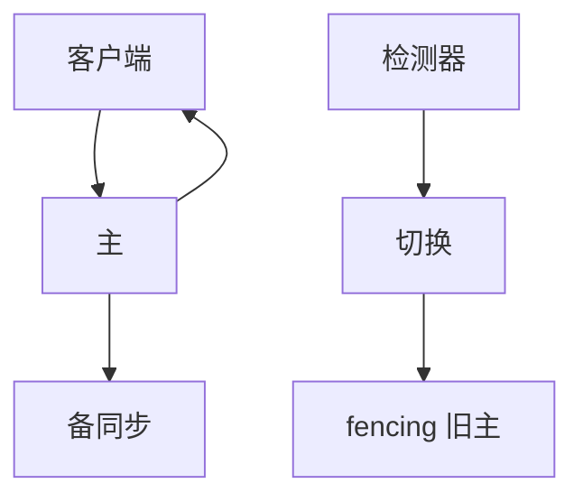

# 主备与故障切换

同一时刻只有一个主接受写。主挂了要切：切慢则不可用，切错则双主，线性一致在缝里破裂。

<footer>—— 据 Budhiraja, Marzullo, Schneider and Toueg, The Primary-Backup Approach, 1993；Lynch 教材中初级备份整理</footer>

上一课[CAP](/cs/cap-pacelc)说分区时要么拒绝要么分叉。主备是最常见的 CP 形状：少数派（旧主所在分区）必须停写。缺口是**切换协议**：谁宣布新主、旧主如何fencing。本课不写 Paxos 全文。后课链式复制把「备」排成一条流水。

## 问题

初级备份：客户端把请求发给主，主执行、把状态或日志送到备，再应答。同步备：应答前备已有；异步备：应答后才赶——后者丢失最后若干写，不是线性一致故障切换。

故障切换：检测器怀疑主 → 选新主 → 旧主若仍活必须拒写。缺口是脑裂：网络分区里两侧都认为自己是主。没有 fencing，线性化点消失，出现分叉写。

Budhiraja 等把主备与状态机复制对照：主备常传状态增量，状态机传输入日志。后课 RSM 再钉。

## 方法

选主：固定优先级、或租约、或共识（后课）。Fencing：纪元号、磁盘租约、存储序列号——旧主 I/O 被拒绝。客户端必须带纪元，或通过总是问目录服务「现主是谁」。

热备 vs 冷备：热备已 apply 日志，切换 RTO 小；冷备从快照赶。RPO 由同步还是异步决定。

## 机制

同步主备的提交点：多数备还是全部备。等全部则一备慢就拖主（PACELC 的 L）；等一个则那个备挂时可能丢。自动切换依赖[故障检测器](/cs/failure-detectors)与[租约](/cs/leases)：误怀疑会造成不必要 failover，正确性仍靠纪元单调。

只读从库：默认不是线性一致读。要线性一致读必须读主，或读从库但等到主的提交位置（read index）。这把「有备」和「强读」拆开。

本课不把 DNS 改 A 记录当 fencing：TTL 期间客户端仍打旧主。也不把云厂商「自动 HA」当协议证明。

## 边界

本课不写链式复制的头尾，不写 quorum 的 $R+W$。不引入拜占庭主。后课默认：主备的安全 = 同期至多一主 + 同步复制的提交点；活性 = 检测与选主。脑裂是 fencing 没做，不是 CAP 的新例外。

切换是分布式系统里最贵的控制面路径之一。正确性在纪元，不在心跳间隔。

## 小结

- 同步主备可线性一致；异步备切换会丢尾写。
- 故障切换必须 fencing 旧主，防双主。
- 从库读默认弱于主上线性一致读。
- 出处：Budhiraja et al., 1993；Gray–Cheriton 租约。
