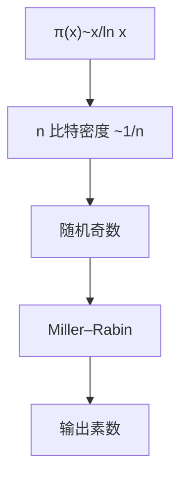

# 素数分布与生成

素数定理：$\pi(x)\sim x/\ln x$。随机奇数被素的概率约 $2/\ln n$，故重复抽检（Miller–Rabin）即可生成密码学素数。

<footer>—— 据 Hadamard；de la Vallée Poussin；Knuth 卷 2；Menezes, van Oorschot and Vanstone 整理</footer>

上一课[Miller–Rabin](/cs/miller-rabin) 会检验给定 $n$。缺口是**生成**：随机选 $n$ 比特奇数，测素性，失败再抽。素数定理保证期望试验次数 $O(n)$。安全素数、强素数是额外约束。本课不证素数定理。

## 问题

$\pi(x)\approx x/\ln x$，于是 $n$ 比特素数密度 $\sim 1/n$。偶数扔掉，再过小素筛（试除 $3,5,7,\ldots$）减少 MR 次数。RSA 要两个同量级素 $p,q$；DH 要 $p$ 使 $p-1$ 有大素因子（上一课 DLP）。Maurer、Shawe-Taylor 可证明素数构造点名；实践仍是随机 + MR。

不要用确定性「第 $k$ 个素数公式」当算法——没有可用的闭式生成器。

### 密度不是随机性的证明

素数看起来无公式，仍可能有未知结构。密码学把「随机素数」当工作假设加 MR 错误界，不是 Riemann 假设课。

素数定理 1896。Cramér 模型点名。HAC（Menezes et al.）第 4 章生成。FIPS 186 的方法是标准实践，本课不抄参数表。

## 方法

估 1024 比特：$1/\ln(2^{1024})\approx 1/710$，奇数再 $\times 2$，期望几十到上百次 MR。写筛 + MR 流程。点名：共用素数、过小 $p-q$ 是实现事故，不是分布定理。

## 机制

数论单元的「随机素」与平均复杂度课的 OWF 衔接：RSA 模是这种抽样的输出。下一课换群：椭圆曲线，素数仍作为域的特征或阶的因子出现。

Dirichlet：算术级数里也有无穷素，故可要求 $p\equiv 3\pmod 4$ 等。

Dirichlet：互素的 $a,n$ 上 $a+kn$ 有无穷素，故可强制 $p\equiv 3\pmod 4$（Tonelli 简单）。安全素数更稀，抽样要更久。不要从低位素数表「拼」一个大数当 $p$。共用 NIST 素数在 DH 上可接受（公开参数），RSA 的 $p,q$ 必须新抽。

## 边界

本课不证素数定理，不引入 ζ 函数。不讨论量子 Shor 对已生成模数的威胁（BQP 课已点名）。后课默认：密码学素数 = 密度保证下的随机 + MR。下一课椭圆曲线群。

密度 $1/\ln n$ 让随机抽样可行，不是给出第 $k$ 个素数公式。RSA 的 $p,q$ 要独立新抽；DH 可用标准安全素数。筛掉小素因子只是为了少跑 MR。

## 小结

- 素数定理给出 $n$ 比特密度 $\sim 1/n$，抽样可行。
- 生成 = 随机 + 筛 + Miller–Rabin。
- DH/RSA 还要对 $p-1$、$p,q$ 间距加约束。
- 出处：Hadamard；de la Vallée Poussin；HAC；Knuth。
