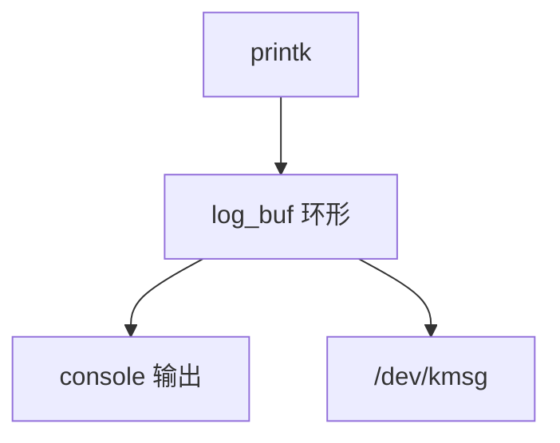

# printk

printk 把内核消息写入环形缓冲：级别、时间戳、可从 /dev/kmsg 读；它必须在几乎不能睡的上下文里仍能用。

<footer>—— 据 Linux printk 文档；[audit](/cs/kernel-audit) 为安全日志对照</footer>

[上一课](/cs/suspend-resume) 失败时常只剩串口。[NMI](/cs/nmi) 也不能睡。缺口是 **printk**：环形缓冲、console、与延迟打印。观测课序从此开始。

## 问题

`printk` 格式化进 `log_buf`。级别：KERN_ERR 等。缺口：锁与递归；nbcon 多 console；丢消息当缓冲满。本课不把每条格式说明符当作业。

`pr_debug` 可编译去掉。early printk 在控制台驱动前用特定硬件。对象是内核日志，不是 systemd journal 全文。

## 方法

调用 printk → 写入 ring → 唤醒 klogd/journal。对照 [sk_buff](/cs/skbuff)：一个包，一个字符环。对照 ftrace 后课：printk 太重不能每包用。对照 [fsync](/cs/fsync)：kmsg 默认不持久。

## 机制

printk 是内核最旧的观测面，保证「还能说话」。税是锁与串口慢。不要写成 ELK 栈。与 [KPTI](/cs/kpti-os)：用户读 kmsg 要权限。

风暴：中断里 printk 可活锁，需限速。

实现上：console_lock 曾让多核 printk 变成串行灾难，nbcon 在改这。rate limit 防止中断风暴自激。持久要靠 pstore 或用户态 journal，ring 重启即逝。 读法上只引用[上一课](/cs/suspend-resume)的结论，不把对象换成训练推理或限价簿。

本课在操作系统进阶的「安全、启动与调试 / 观测与调试」课序里，对象是 **printk**。

- 先修只引用，不重导：上一课的结论当公理，本课只补差。
- 五栏不吞并：不把本课写成大模型训练/推理，也不写成限价簿或权重量化。
- 文献用 OSTEP、McKusick、内核文档与具名会议论文；不发明 arXiv 编号。

## 边界

本课不引入所有 index/seq。不保证崩溃时环还在——kdump 后课。下一课低开销跟踪：ftrace。

版本字段会变，课序钉的是机制对象「printk」，不是某一主线内核的结构体名。
后课默认：内核消息进 ring buffer。静态与动态 tracepoint，下一课 ftrace。

## 小结

- printk 写环形缓冲并可选打到 console。
- 必须能在受限上下文使用；满则丢。
- ftrace 是下一课。
- 出处：Linux printk；kernel logging。
