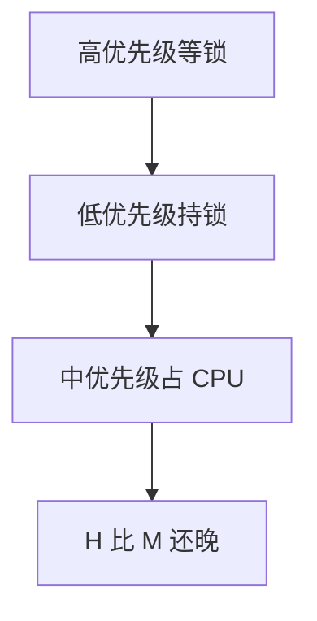
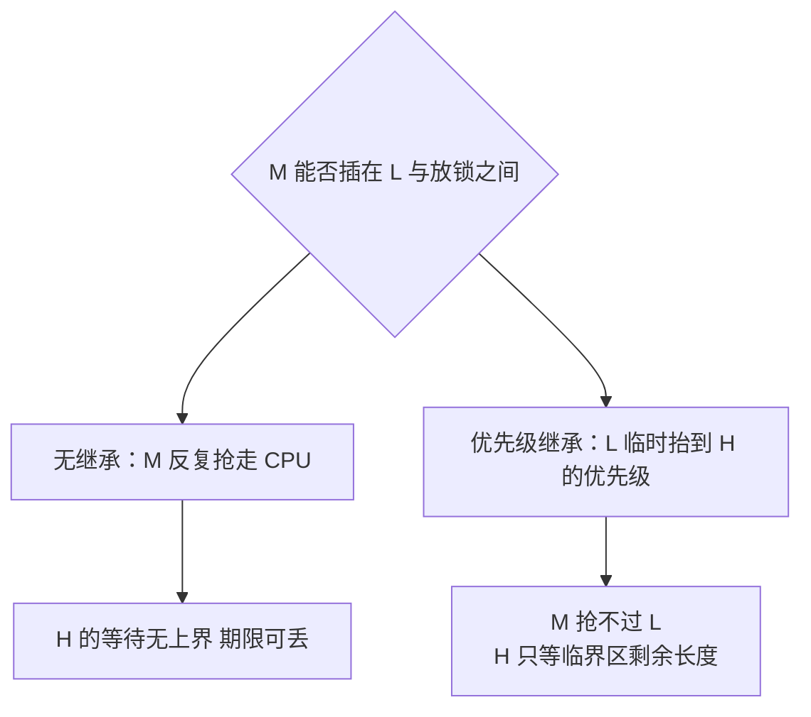

# 优先级反转

低优先级线程占着锁，中优先级线程占着 CPU，高优先级线程忙等或睡眠等锁——优先级在锁上被翻转了。

<footer>—— 据 Silberschatz et al., Operating System Concepts；火星探路者故障中的优先级反转讨论整理</footer>

[上一课](/cs/mlfq)让高档任务先跑。一旦共享数据要互斥，低优先级可以持锁；高优先级要同一把锁就只能等。若此时中优先级可运行且不碰那把锁，它会抢走低优先级的 CPU，于是锁迟迟不放，高优先级比中优先级还晚——**优先级反转**。本课只诊断现象，不把继承协议写完。

## 问题

调度器按优先级选 runqueue 队头，它看不见锁。高优先级不是死锁（低优先级最终可能跑完并放锁），但期限可以丢。[实时调度对照](/cs/realtime-sched)还会点这名字，那时也没有锁课。缺口是：在已经有优先级的系统里，**锁把优先级序与逻辑依赖拧反**。本课仍不实现自旋锁，只假设存在互斥。

无界反转：任意多个中优先级可以轮流挡住持锁者。有界反转：只有持锁者自己的剩余临界区，前提是中优先级不能插在持锁者与放锁之间。

常见误区：把反转当死锁。死锁的等待图有环、谁也动不了；反转里低优先级最终会跑完放锁，系统没卡死——只是高优先级错过了不该错过的期限。

## 方法

三线程：$L$ 持锁，$H$ 等锁，$M$ 不碰锁但优先级在二者之间。时间线： $L$ 被 $M$ 抢占 → $H$ 无法前进。对照：若禁止 $M$ 在 $L$ 持锁期间跑（或让 $L$ 暂时等于 $H$ 的优先级），则 $H$ 的等待只剩临界区长度。本课只画清问题，把「暂时抬高」留给下一课。

```mermaid
flowchart TD
  L["低优先级持锁"] --> M["中优先级占 CPU"]
  H["高优先级等锁"] --> L
  M --> INV["H 比 M 还晚"]
```

ISR 里拿锁会把反转变成关中断时间，更难看；那是锁与 IRQ 课的对象。

## 机制

反转说明「优先级」只描述调度器的意愿，不描述资源上的等待图。MLFQ 的档位、实时 FIFO、nice，只要能和锁相遇，都会中招。公平调度的 vruntime 也会因锁而让「该跑的人」跑不成，只是不叫优先级反转而叫锁争用；本课对象是显式优先级。

直觉类比：急诊室里重病号 H 在等唯一空闲的主治医生 L（他手里拿着病历锁），而普通门诊病人 M 不断插队占用 L 的时间——病不是治不好，是次序被搅乱了。

同样三个线程，「放任 M 插队」与「加优先级继承」的等待时长差一个数量级：

```mermaid
flowchart TD
  Q{"M 能否插在 L 与放锁之间"} --> U["无继承：M 反复抢走 CPU"]
  U --> UB["H 的等待无上界 期限可丢"]
  Q --> P["优先级继承：L 临时抬到 H 的优先级"]
  P --> PB["M 抢不过 L<br/>H 只等临界区剩余长度"]
```

为什么重要：继承的妙处在于不改调度器、不改锁的实现语义——只是在 H 阻塞在锁上的一瞬间，把持锁者 L 的优先级临时抬到 H 的等级，放锁后还原，插队链条就断了。

## 边界

本课不把探路者软件的补丁当操作手册，不引入优先级天花板的全部证明。死锁四条件更后；反转的等待图无环也可发生。用户态锁同样能反转，只要内核按优先级调度那些线程。

后课默认：反转是锁与优先级的结构后果。如何用继承或天花板把等待有界化，下一课讲 PI 与 PCP。

数字实例：1997 年火星探路者在火星上反复重启，正是总线管理线程遭遇优先级反转、被中优先级任务长时间插队放大所致；启用优先级继承后故障消失——教科书概念的真实代价是一台行星探测器。

## 小结

- 反转：低优先级持锁 + 中优先级抢 CPU ⇒ 高优先级被拖。
- 不是死锁，但期限可丢；无界时中优先级可一直插队。
- 继承与天花板是下一课。
- 出处：Silberschatz et al., *OSC*；实时系统教材中的 PI 案例。
