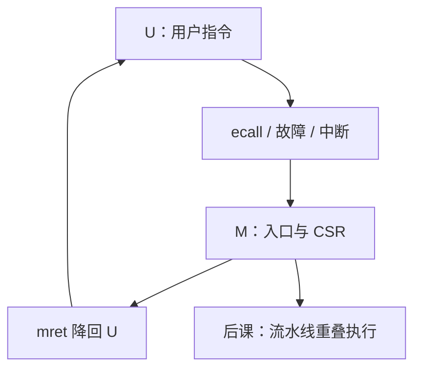

# 特权级

用户程序不能随便写 `mtvec` 或关中断；硬件用特权级挡住这些 CSR 与指令，陷入时才升到能处理入口的那一层。

<footer>—— 据 Patterson and Hennessy, Computer Organization and Design (RISC-V)；The RISC-V Instruction Set Manual, Volume II: Privileged Architecture 整理</footer>

上一课[PLIC 与中断号](/cs/plic-irq)钉死了保存 PC、跳到 `mtvec`。本课不重列 `mcause` 编码，也不从操作系统内核源码另起。缺口是：若用户指令也能写 `mtvec`、执行 `mret`、关全局中断，入口机制立刻被架空。必须把执行模式分成**特权级**，CSR 与某些指令只在足够高的级合法。

## 问题

RV32I 用户级子集没有模式。缺口是 RISC-V 的 M/S/U（教学可先 M 与 U）：当前级存在 CSR `mstatus` 等里。用户执行 `csrw mtvec` 或 `mret` 会非法指令异常。`ecall` 从 U 陷入 M（或 S），硬件升特权并关部分中断，入口代码才可信。返回 `mret`/`sret` 降特权、恢复 PC。

本课只钉「级」与「陷入升、返回降」。页表、用户/内核地址空间是体系结构与 OS 课；这里还没有虚存。组成课主干到此；下一课[流水线五级](/cs/pipeline-five-stage)开始把单周期图切开重叠。

### 特权级不是「环上的操作系统产品名」

x86 的 ring 0–3 是另一套编码；本栏用 RISC-V 的 M/S/U。不要把「Ring 0」当 RISC-V 术语。级也不等于进程：同一 U 级可以有许多进程，那是 OS 用页表造出来的，本课没有。

特权手册定义 M 必现，S 可选。Patterson/Hennessy 用用户/内核对照说明为何异常要换模式。本课不把 SELinux、虚拟化 H 扩展展开。

## 方法

硬件维护当前特权。译码时检查指令是否允许：不允许则异常。陷入：保存先前级，当前级 ← 处理该陷阱的级（如 M）。`mret`：当前级 ← 保存的先前级。中断使能位按级屏蔽，避免入口未保存寄存器时再入。

## 机制

有了级，存储程序机器才分得出「普通加法」与「改入口向量」。后课内核/用户态是本课在 OS 里的名字；系统调用路径 = `ecall` + 本课升级。设备 MMIO 也可以只在 M 可访问，本课只要求检查存在。

组成课不把流水线冒险算进特权：特权是状态，流水线是执行重叠。两者在「流水线异常」叶子才会交汇。

## 边界

本课不实现分页、不讲 TEE、不把安全栏的沙箱提前。虚拟机监控的两层翻译是更后的附录或 OS/体系交界。数字逻辑与计算机组成课程到此收束：能跑带陷阱的 RISC-V 整数核、分用户与机器模式。

后课默认：用户代码在 U，陷阱在更高特权处理。下一起点是：一条指令仍太慢，要用五级流水重叠。

## 小结

- 特权级限制 CSR 与 `mret` 等指令；陷入升、`mret` 降。
- 用户不能改自己的陷阱入口。
- 组成主干停在可编程、可陷阱、分模式的 RISC-V 核；流水线是下一课程。
- 出处：Patterson and Hennessy, COD (RISC-V)；RISC-V Privileged Spec。
