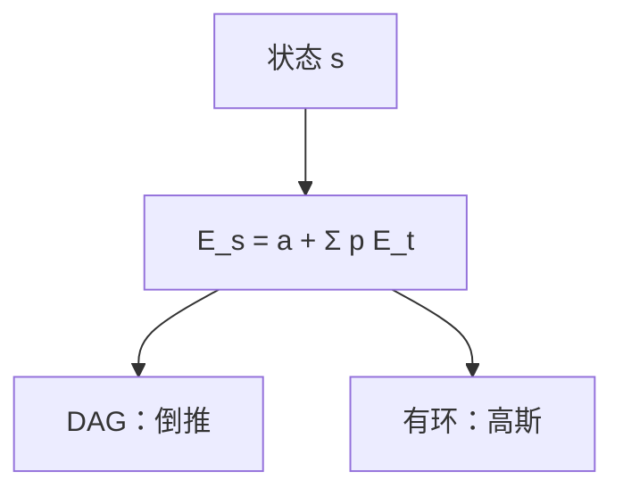

# 概率与期望 DP

期望的线性性不要求独立；状态上列方程 $E=1+\sum p_i E_i$，高斯或拓扑消元，比枚举路径省指数。

<footer>—— 据 CLRS 第 5 章指示器；[期望线性性](/cs/expectation-linearity) 整理</footer>

上一课[莫比乌斯反演](/cs/mobius-inversion)收束数论卷积。主干期望线性性已给指示器。缺口是**状态期望方程**：随机游走步数、直到收集齐的优惠券、博弈随机策略。本单元「多项式、线性与数论」在此结束。下一单元 DP 进阶从状压开始。

## 问题

状态 $s$ 的期望 $E_s$ 满足 $E_s=a_s+\sum_{t} P_{st} E_t$。无后效则拓扑；有环（随机游走）则线性方程组，高斯 $O(n^3)$ 或高斯–约当。概率 DP：到吸收态的概率，方程同类。不要对每条样本路径 DP。

优惠券：$E=n H_n$，不必 DP，但「子集已有」状压期望是后课状压的概率版，本课点名。

### 线性性不是独立性

$E[\sum X_i]=\sum E[X_i]$ 永远成立。方差、是否同时发生才要独立。期望方程里的 $P_{st}$ 已编码转移，不必事件独立。

指示器见 CLRS 5。随机游走期望见标准概率教材。后课状压 DP 把 $s$ 做成比特掩码，方程或递推都可。

## 方法

定义状态。列 $E$ 或 $p$。DAG 倒推；有环高斯。模意义下期望少见，概率可模素数当有理。吸收态边界 0。

无限状态要先压缩或有限化。

## 机制

全期望定律按一步展开。与 Bellman：随机最短路是另一目标（风险）。本课是期望值或到达概率。与内点无关。与蒙特卡洛：方程给精确有理（分数），模拟给估计。

## 边界

本课不写 MDP 策略迭代全文。不把老虎机当本课（后课 UCB）。后课默认：期望可列状态方程；无环倒推，有环高斯。下一课状态压缩 DP。

## 小结

- 期望方程 = 一步展开；线性性不需独立。
- DAG 倒推；有环高斯消元。
- 精确值，不是模拟。
- 出处：CLRS 第 5 章；全期望定律。
