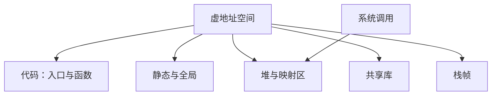

# 进程地址空间一览

进程看见的是一份虚地址地图：代码、静态数据、堆、栈、映射的库；内核用页表把这些落在物理页上，用户只看见合法地址的集合。

<footer>—— 据 Bryant and O'Hallaron, Computer Systems: A Programmer's Perspective；Kernighan & Ritchie, The C Programming Language, 2nd ed. 整理</footer>

上一课[系统调用作为边界](/cs/syscall-as-boundary)钉死了：改内核对象必须陷入。本课不重讲调用号，也不从页表项比特另起。缺口是：栈、堆、静态、动态库、入口，已经分别出现——**它们怎样同时画在一张用户地址地图上**，指针合法与否以这张图为准。本课是程序设计课最后一课；下一课改问这些地址里的字节如何被当成可分辨的比特。

## 问题

第一课产出镜像，第二课分三种存储期，动态链接把额外代码段映进来，系统调用把堆顶与文件映射伸出去。程序员日常说的「地址」是这份虚地图上的点，不是物理内存编号。缺口因此不是再列区域名字，而是**一张总图**：哪些区间可读执行、哪些可写、空指针附近为何通常不可用、栈向哪边长。调试器里的指针、悬挂后仍「能读」的残留，都对照这张图才有意义。

本课不解释编码：同一地址上的字节稍后可以当整数、当指令、当字符，那是[比特作为区分](/cs/bit-as-distinction)的起点。这里只承认：进程先有可访问的地址集合，再谈集合里每个位置上的区分。

### 地址空间不是物理内存条

多进程可以有相同的虚地址数值，指向不同物理页；同一进程里不同虚页可以共享一页只读代码。把 `0x7fff…` 当成「机器上的绝对位置」，会无法理解随机化与共享库加载基址。系统调用 `mmap` 往地图上加洞或加块；`brk` 一类接口抬高堆。用户不能用普通写指令改页表——那正是上一课的边界。

CSAPP 第 9 章把虚存当成程序员可见的地址空间加页表。K&R 的指针则默认在这张图的合法对象上移动。本课收口程序课，不把 TLB 与缺页处理写完。

## 方法

典型用户空间草图（具体布局随操作系统与架构而变）：低地址附近留空，以免空指针解引用落到有效对象；然后是可执行文件的代码与静态数据；堆从此向上（或经 `mmap` 另找空洞）增长；高地址附近是栈，向低地址增长；中间映着共享库。权限按页：代码读执行、数据读或读写、栈通常可读可写不可执行（现代默认）。

合法指针必须指向某个活对象所在的映射，并满足对齐与类型。越出映射的访问由硬件与内核变成信号或终止，这是未定义行为在实现上的一种表现，不是语言给的语义。

入口、PLT、栈、堆在这张图上同时存在，程序课开头的那条编译链至此闭合：链接给出静态布局，加载与系统调用给出动态块，调试器按图解释指针。不要在本课引入物理页框号或磁盘交换；那是操作系统虚存实现。也不要把地址上的字节解释成整数或指令——下一课[比特作为区分](/cs/bit-as-distinction)才给区分，再往后才有进制与补码。程序课交出去的是：你会从源跑到进程，并知道指针相对于哪一张用户地图合法。

## 机制

有了总图，前面各课的对象都有落点：自动变量在栈映射里，静态在数据映射里，`malloc` 在堆映射里，`printf` 的指令在库映射里，陷入不改变用户地图的「形状」，只是暂时用内核地图。程序课到此可以停：你会从源走到入口，知道对象住在哪一类区间，知道跨边界要链接、要陷入。下一课不再扩大这张图，而问区间里的比特如何成为可编号的状态。

动态库、堆扩展与栈增长都会改地图，但改法走系统调用或内核在缺页时的隐式扩展，而不是用户随便写一个地址就长出一页。栈溢出常常先碰到守卫页，变成信号；堆越界可能破坏分配器元数据，症状延迟到下一次 `malloc`。这些都是地图与寿命的交叉，不是编码问题。随机化让同一程序两次运行的栈地址不同，把绝对地址写进文件会失去可复现性——调试要记的是偏移与映射权限。下一课从这张图里取出一个地址上的字节，问它如何成为可分辨的 0 与 1，而不再扩大区间名单。

## 边界

本课不讲页表硬件格式、不讲交换、不把物理地址请进来当程序员日常工具。编码、进制、补码交给信息与离散课程；不要在本课重写 Gray 码或 ASCII。后课默认：用户指针活在进程虚地址地图的映射里；区域分工即程序课的存储期；下一课从比特区分开始，不再从「计算机是什么」讲起。

## 小结

- 进程地址空间是虚地图：代码、静态、堆、库、栈，权限按页。
- 指针合法性相对于这张图与对象寿命，不是相对于物理内存条。
- 程序设计课到此收束；下一课是[比特作为区分](/cs/bit-as-distinction)，管编码而不管再画一张图。
- 出处：CSAPP 虚存与链接；K&R 的指针与存储期在这张图上的落点。
