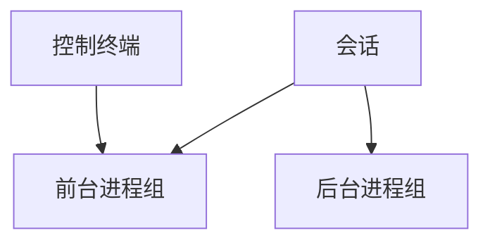

# 进程组与会话

进程组是可以一并发信号的作业；会话把一组进程绑到控制终端，前台组才能读终端。

<footer>—— 据 Stevens and Rago, Advanced Programming in the UNIX Environment；Tanenbaum MOS 整理</footer>

[上一课](/cs/exit-reap)让单个 PCB 能干净结束。shell 的 `|` 与后台 `&` 要一次管理**多个进程**：Ctrl-C 应打到前台那一组，而不是随机一个 PID。[信号](/cs/signals)已能按 PID 投递。缺口是把 PCB 编成**进程组**与**会话**，并与控制终端挂钩。本课只钉这套作业控制对象。

## 问题

管道两端是两个 PID，用户希望「打断这条命令」时两个都停。进程组 ID（PGID）通常等于组长的 PID；`kill(-pgid, sig)` 打到组内。会话（SID）由会话首领 `setsid` 创建，脱离旧控制终端，成为守护进程的常见步骤。缺口不是再讲 wait，而是 PCB 上的 pgid/sid 与 tty 的前台组字段。

前台进程组可从终端读；后台组读终端会被 `SIGTTIN` 停下。这是作业控制，不是新的文件描述符类型。

## 方法

`setpgid` 把进程移入某组（受限：须在同一会话）。`setsid` 创建新会话、新组，切断控制 tty。终端驱动记住前台 PGID；收到中断字符则向该组发 `SIGINT`。orphan 进程组（组内无成员的父在同一会话）有额外停止信号规则，主干承认「后台作业与 tty 的关系要收口」，不背整章 POSIX。

fork 默认继承组与会话；exec 不改。shell 在 fork 之后、exec 之前 `setpgid`，把管道各段收进同一作业组。

## 机制

组把信号从「一个 PCB」抬到「一个作业」。与[孤儿与 init](/cs/orphan-init)叠加：会话首领退出可能挂断终端，向该会话发 `SIGHUP`。调度器仍按线程选 CPU，不按组调度——组不是调度实体。组只影响信号投递与 tty 权限。

## 边界

本课不把 System V 会话与 BSD 作业控制的历史分歧写完，不把 systemd 的 scope 当 OS 原语。窗口系统里的「前台」不是 tty 前台组。线程尚未从进程里拆开：下一课才在同一地址空间挂多条流。

后课默认：作业是进程组，会话绑 tty。同一份用户页上如何跑多条控制流，下一课讲[线程与共享地址空间](/cs/thread-shared-addr)。

## 小结

- 进程组：一并发信号的作业；会话绑控制终端。
- 前台组读写 tty；组不是调度实体。
- 同地址空间多控制流是下一课线程。
- 出处：Stevens and Rago, *APUE*；Tanenbaum and Bos, *MOS*。
