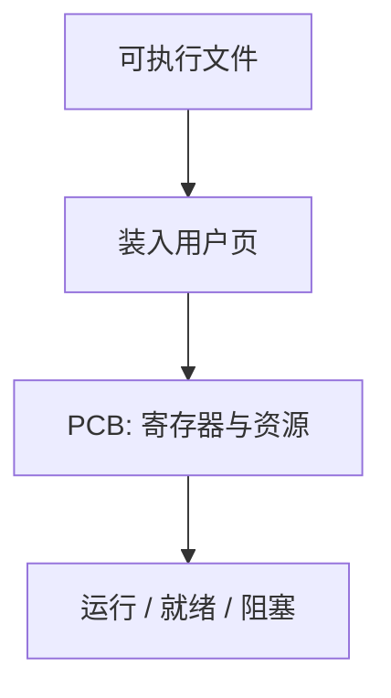

# 进程映像

进程是正在执行的程序；它不止是代码，还包括程序计数器、寄存器和变量。

<footer>—— 据 Tanenbaum and Bos, Modern Operating Systems 整理</footer>

[上一课](/cs/percpu)钉死内核拥有机器、用户态只能陷入。[分页](/cs/paging-vm)已经给出每个地址空间自己的页表。缺口是：内核要在许多用户程序之间切换，还没有命名被切换的那一份**状态包**。本课把这份包叫做进程映像，不重讲页表怎么走。

## 问题

磁盘上的可执行文件是死的字节。[加载与动态链接](/cs/load-dynlink)把它放进内存，但「正在跑」还需要：当前 PC 与通用寄存器、用户栈、堆、打开的文件、页表根。若只保存代码，切换回来时局部变量和文件偏移都丢了。缺口不是新的特权级，而是内核里一份可挂起、可恢复的映像。

本课不把线程从进程里拆开，那是下一课。这里默认一个进程一条执行流，映像与地址空间一一对应。

Unix 把进程控制块（PCB）做成内核对象：PID、状态、寄存器副本、内存描述、文件描述符表。映像是 PCB 加上它指向的用户页。

## 方法

映像至少含：用户地址空间（后课才画布局）、寄存器组、内核栈或陷入帧、资源表（文件、信号掩码稍后补）。创建进程是分配 PCB、建立页表、把程序装入；退出是回收这些。就绪、运行、阻塞是映像的三种调度可见状态，具体排队在调度课。

fork 与 exec 的细节、写时复制，都还没有；本课只要求「一份映像 = 一份可调度的用户状态」。

## 机制

内核切换时，当前映像的寄存器写入 PCB，页表根换成下一份，再恢复其寄存器。用户程序看不见这次保存；它只觉得自己一直在算。[TLB](/cs/tlb-translate) 在换根之后必须失效或带地址空间标签，否则会用错页。本课不重导 TLB，只点明：换进程就是换映像，译址硬件跟着换。

文件偏移、工作目录属于映像而不是属于代码文件：同一程序跑两份，各有各的描述符表。这是后课管道两端各是一个进程的前提。

## 边界

本课不引入轻量线程，不把容器与 cgroup 请进来，也不把进程树与会话写成 Unix 手册。僵尸与孤儿是实现细节，主干只承认「映像可以等子进程」。安全课的隔离会用同一对象，本课不讲沙箱策略。

内核栈与用户栈分开：陷入时硬件切栈，映像里两套指针都要保存。

后课默认：谈到「一个正在跑的程序」，它有 PCB 与用户地址空间。一个进程里如何出现多条执行流，下一课收。

## 小结

- 内核切换的对象是进程映像，不是磁盘上的二进制。
- 映像含寄存器、页表根、资源表；状态是运行、就绪、阻塞。
- 线程共享同一地址空间，是下一课的缺口。
- 出处：Tanenbaum and Bos, *MOS*；Silberschatz et al., *OSC* 进程概念。
