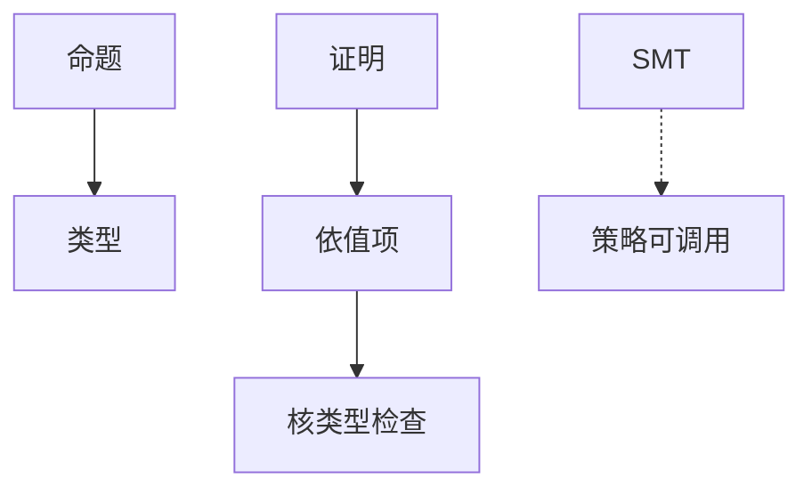

# 证明助手与依值类型直觉

Curry–Howard：证明即程序，命题即类型。依值类型让类型依赖值，等式可在类型里出现。助手检查推导；人仍要给不变式与策略。计算理论补层在此封口。

<footer>—— 据 Martin-Löf；Howard；The Univalent Foundations Program, Homotopy Type Theory 整理</footer>

上一课[SMT](/cs/smt-solver) 自动但碎片化，失败时给模型不给可搬运的证明对象。缺口是**交互证明助手**：Coq、Lean、Isabelle。本课直觉：类型 = 命题，项 = 证明；依值类型为何能写「长度为 $n$ 的向量」。不教安装，不重写 λ 课的 β。

## 问题

简单类型 λ 对应直觉主义命题：$\to$ 是函数。要证 $\forall n,\ldots$ 需要依值：$\Pi n:\mathbb{N}.\,P(n)$。等式类型 $a=b$ 的证明是同一化或改写。助手核：类型检查可判定（或可检查），信任基小。策略（tactic）生成项，核再验。相对 SMT：这里证明是一等对象，可抽取程序；代价是人写。

[自然演绎](/cs/natural-deduction) 的引入消去正是类型构造子/消去子。Hoare 三元组可内嵌为类型，或另做验证条件再 SMT——两条路可混（why3）。

### 不是「AI 写完证明」

自动策略、 hammers 会调用 SMT，但仍要类型正确。不可判定的一阶碎片不会因依值类型变可判定；人选择归纳与引理。

Howard 1969 笔记；Martin-Löf 类型论。Coq/Lean 实现 CIC 变体。HoTT 书是同伦视角，本课不进路径类型。Isabelle/HOL 是简单类型高阶逻辑，另一风格，点名。

## 方法

用「偶数 + 偶数 = 偶数」的归纳形状对照自然演绎 $\forall$ 引入。指出：终止检查对应完全正确；允许非终止则逻辑崩溃（$Y$ 无类型）。对照[递归定理](/cs/recursion-theorem)：助手里一般禁止无类型自应用。

## 机制

计算理论课程收束：自动机到 TM，可计算与复杂，信息与数论，最后逻辑把「证明」连回程序。主干系统栈在[边界](/cs/to-systems-boundary) 已封；本补层不重开 OS。后课若有附录文献，不插入这条课序。

抽取：构造性证明可变成程序；经典排中律抽取需额外机制。

宇宙层级避免 Russell。归纳类型同时给出构造与消去（递归）。抽取到 OCaml/Haskell 把计算部分变成程序，证明部分擦掉。Isabelle/HOL 用简单类型 + 高阶逻辑，自动化强、依值弱。本补层封口：主干系统栈已在[边界](/cs/to-systems-boundary) 结束，计算理论课序不重开 OS。

## 边界

本课不写 CIC 的全体宇宙规则，不引入立方类型论。不把形式化数学库当作业清单。补层「计算理论」到此结束：后课默认，证明助手是检查依值项的核，与 SMT 互补而非替代。

核检查依值项，策略可调用 SMT，证明仍是一等对象。Curry–Howard 把自然演绎接回程序。计算理论补层封口，不重开已在系统边界结束的主干栈。

## 小结

- Curry–Howard：命题–类型，证明–程序。
- 依值类型表达依赖值的规范；核小、策略大。
- 与 SMT 分工：可搬运证明 vs 自动判定碎片。
- 出处：Martin-Löf；Howard；Coq/Lean 与 HoTT 文献。
