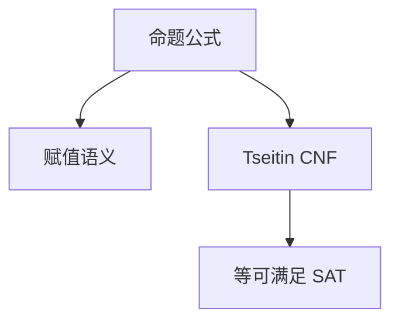

# 命题逻辑与范式

命题公式由原子与连接词建成；语义是赋值到 $\{0,1\}$。CNF 把可满足性收成子句集合，Tseitin 变换多项式保持可满足，不必指数展开。

<footer>—— 据 Enderton, A Mathematical Introduction to Logic；Tseitin, 1968 整理</footer>

数论单元在[LWE](/cs/lattice-lwe) 结束。逻辑单元从公式起。[布尔代数](/cs/boolean-algebra) 已给与或非公理；主干[SAT 与 3-SAT](/cs/sat-3sat) 已把 CNF 当 NP 对象。缺口是**作为证明系统的命题逻辑**：语法、语义、NNF/CNF，以及「等价变换」与「等可满足」的差别。后课量词、自然演绎默认已读完本课的公式层。

## 问题

原子 $P,Q,\ldots$，连接 $\neg,\land,\lor,\to$。赋值 $v$，归纳定义 $v(\varphi)\in\{0,1\}$。重言式：一切 $v$ 为真；可满足：存在 $v$。CNF：子句合取；DNF：项析取。把任意公式展成等价 CNF 可指数（分配律）。Tseitin：给每个子公式新变元，加表示「新变元 $\leftrightarrow$ 子公式」的常数个子句，**等可满足**、规模线性。SAT 求解用后者。

[Cook–Levin](/cs/cook-levin) 的表格产出的已是 CNF 形状；本课给手工公式一条进 CNF 的路。

### 范式不是化简

卡诺图、Quine–McCluskey 求最短与或式，对象是电路代价。本课 CNF 为判定与归结服务，子句可以多。

Enderton 命题章。Tseitin 1968 对扩充归结。Davis–Putnam 时代已用 CNF。本课不跑 DPLL——那是本单元后部。

## 方法

写一份含 $\to$ 的公式，先去 $\to$，再 NNF，再 Tseitin 而不暴力分配。强调：重言式判定 coNP（UNSAT）；可满足 NP。真值表指数，不是算法出路。

## 机制

有了 CNF，归结、CDCL 才有子句数据库。完备性下一课仍对自然演绎，对象可先是任意公式。本课不引入量词：命题没有「对所有整数」。

布尔代数的等价变形保持语义相等；Tseitin 只保持可满足，多出来的变元无原公式对应。

紧致性：无限命题集合可满足当且仅当每个有限子集可满足——后课不用。归结对 CNF 反驳完备，CDCL 是其工程后代。Tseitin 增加的变元必须被约束到子公式真值，否则 SAT 会「借假变元」满足。与布尔化简课分工：那里最短式，这里判定。

## 边界

本课不证紧致性，不引入模态。不重做 3-SAT 拆句。后课默认：公式有语法树与赋值；进求解器走 Tseitin CNF。下一课谓词与量词。

真等价的 CNF 可指数；SAT 求解用 Tseitin 等可满足。可满足 NP、重言 coNP，真值表不是算法。后课量词把赋值从 $2^n$ 换成可能无穷的论域。

上一课留下的缺口在本课收口；「命题逻辑与范式」进入后课词汇表后只引用。文献用来钉对象与边界，不把本课写成该主题的独立综述。

## 小结

- 命题：语法 + 赋值语义；CNF 是子句合取。
- Tseitin 多项式等可满足，真等价 CNF 可指数。
- 可满足 NP，重言 coNP；真值表不是出路。
- 出处：Enderton；Tseitin, 1968。
