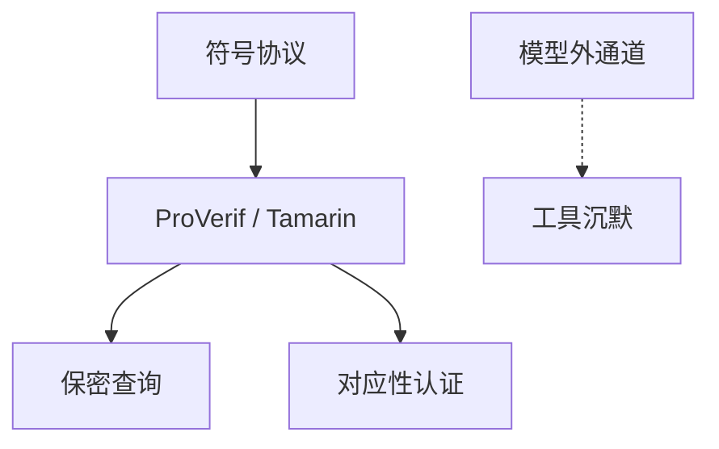

# 协议形式化 ProVerif / Tamarin

符号模型把加密当理想锁，穷举角色与消息，问保密与认证是否在 Dolev–Yao 下可破。ProVerif 与 Tamarin 把这份穷举收成工具；证明的是模型，不是 C 代码。

<footer>—— Blanchet, ProVerif；Meier, Schmidt, Cremers 与 Basin, Tamarin；Dolev and Yao, 1983</footer>

## 定位

上一课[生物识别](/cs/biometrics-far-frr)结束因素课。缺口是把[Dolev–Yao](/cs/dolev-yao)变成**可跑的验证**：Needham–Schroeder 下一课就是经典反例。本课工具直觉，不教安装，不重写 TLA+。

后课默认已经读完本课钉下的合同，只补差，不从该领域第一性原理重开。

## 问题

手工论证易漏角色交错。符号工具：规则重写或 Horn 子句，查询「攻击者能得到 nonce 吗」。计算模型（CryptoVerif 等）更近归约，更贵。缺口是模型边界：计时、填充预言、代数都可能在符号外。

### 找到攻击是强结果

「无攻击」相对于模型。漏掉一条信道就漏攻击。Lowe 的修复正是模型里多出来的身份字段。

Blanchet 的 ProVerif；Tamarin 的多重集重写。本课不把工具当 seL4 那种 C 验证。

## 方法

写协议为规则；标秘密与对应性断言（认证）。指出无界会话是难点，要抽象。下一课用 NSL 把「工具为谁发明」讲成故事。

图中节点是本课的机制骨架；课程不把图展开成可运行的攻击步骤。

## 机制

形式化把身份单元从「清单」升到「可证的交错」。下一课 Needham–Schroeder：经典认证协议如何在模型里被 Lowe 指出漏洞。

前提写进合同之后，游戏外的误用只当失败模式点名，不在本课写成操作程序。

## 边界

本课不验证 TLS 全文。Needham–Schroeder 与 Lowe 下一课。

## 小结

- 因素课之后，用符号工具看协议交错。
- ProVerif/Tamarin 证明模型内的保密与认证。
- 计时与实现通道在模型外。
- 下一课：NS 与 Lowe 修正。
- 出处：Dolev and Yao, 1983；Blanchet；Meier et al., Tamarin。
