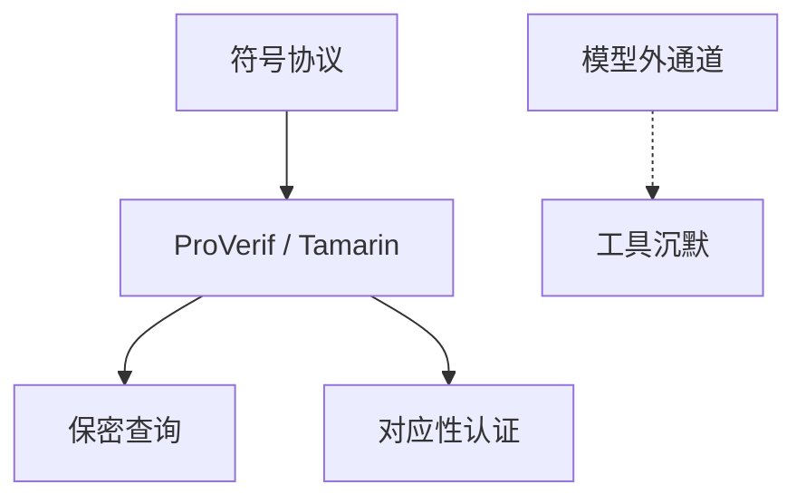
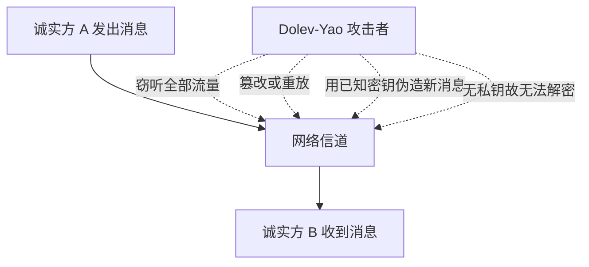

# 协议形式化 ProVerif / Tamarin

符号模型把加密当理想锁，穷举角色与消息，问保密与认证是否在 Dolev–Yao 下可破。ProVerif 与 Tamarin 把这份穷举收成工具；证明的是模型，不是 C 代码。

<footer>—— Blanchet, ProVerif；Meier, Schmidt, Cremers 与 Basin, Tamarin；Dolev and Yao, 1983</footer>

上一课[生物识别](/cs/biometrics-far-frr)结束因素课。缺口是把[Dolev–Yao](/cs/dolev-yao)变成**可跑的验证**：Needham–Schroeder 下一课就是经典反例。本课工具直觉，不教安装，不重写 TLA+。

后课默认已经读完本课钉下的合同，只补差，不从该领域第一性原理重开。

## 问题

手工论证易漏角色交错。符号工具：规则重写或 Horn 子句，查询「攻击者能得到 nonce 吗」。计算模型（CryptoVerif 等）更近归约，更贵。缺口是模型边界：计时、填充预言、代数都可能在符号外。

### 找到攻击是强结果

「无攻击」相对于模型。漏掉一条信道就漏攻击。Lowe 的修复正是模型里多出来的身份字段。

Blanchet 的 ProVerif；Tamarin 的多重集重写。本课不把工具当 seL4 那种 C 验证。

可以把符号模型里的加密想象成理想保险箱：Dolev–Yao 攻击者是快递网里的恶意快递员——能拆开外包装看、扣下包裹、投假包裹、把旧包裹重投一遍，但撬不开箱子本身；没有私钥，密文对他就是一块石头。

## 方法

写协议为规则；标秘密与对应性断言（认证）。指出无界会话是难点，要抽象。下一课用 NSL 把「工具为谁发明」讲成故事。

```mermaid
flowchart TD
  SPEC["符号协议"] --> TOOL["ProVerif / Tamarin"]
  TOOL --> SEC["保密查询"]
  TOOL --> AUTH["对应性认证"]
  MODEL["模型外通道"] -.-> SIL["工具沉默"]
```

## 机制

形式化把身份单元从「清单」升到「可证的交错」。下一课 Needham–Schroeder：经典认证协议如何在模型里被 Lowe 指出漏洞。

```mermaid
flowchart TD
  A["诚实方 A 发出消息"] --> NET["网络信道"]
  NET --> B["诚实方 B 收到消息"]
  ATK["Dolev-Yao 攻击者"] -.窃听全部流量.-> NET
  ATK -.篡改或重放.-> NET
  ATK -.用已知密钥伪造新消息.-> NET
  ATK -.无私钥故无法解密.-> NET
```

上图回答「符号工具替你穷举的那个敌人长什么样」：攻击者坐在信道上，四件事随便做（听、改、重放、造），一件事永远做不了（无密钥的解密）。工具的查询就是在问：这样折腾几轮之后，nonce 会不会漏进他的知识库里。

初学者容易以为工具说「无攻击」就等于协议安全。实际上结论只对写进模型的信道与能力负责：漏写一条侧信道（计时、报错提示、填充预言），攻击就恰好藏在工具沉默的那块地方。

## 边界

本课不验证 TLS 全文。Needham–Schroeder 与 Lowe 下一课。

找到攻击是强结果：工具给出一条具体的消息交错序列，人可以照着重演攻击；而「模型内无攻击」只是与模型同宽的弱结论。一强一弱，读工具输出时要分清自己拿到的是哪一个。

## 小结

- 因素课之后，用符号工具看协议交错。
- ProVerif/Tamarin 证明模型内的保密与认证。
- 计时与实现通道在模型外。
- 下一课：NS 与 Lowe 修正。
- 出处：Dolev and Yao, 1983；Blanchet；Meier et al., Tamarin。
