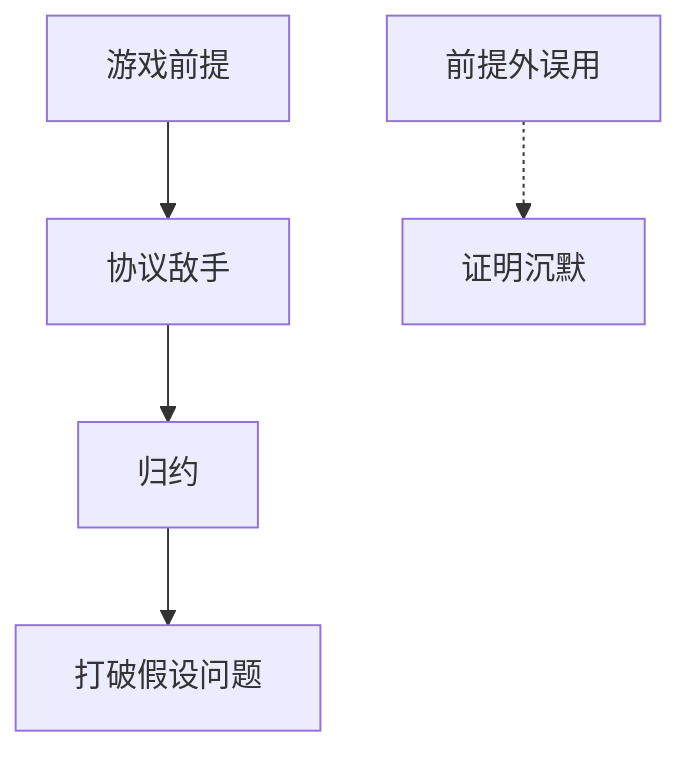

# 可证明安全与归约

证明不是「没人破过」，而是：若敌手能赢这个游戏，就能构造算法赢那个被认为难的问题。归约把产品安全感绑到假设上；假设外的误用，证明沉默。

<footer>—— Goldwasser and Micali, Probabilistic Encryption, 1984；Bellare and Rogaway 的游戏化方法；Katz and Lindell</footer>

## 定位

上一课[同态](/cs/homomorphic-intuition)把电路评在密文上。本单元从一次一密走到外包计算，缺口是把**游戏与归约**收成方法论：IND-CPA/CCA、EUF-CMA、ROM。不把证明助手课的 Coq 再讲一遍；那是形式核，这里是密码学归约。

后课默认已经读完本课钉下的合同，只补差，不从该领域第一性原理重开。

## 问题

Shannon 完善保密不需计算假设。其余原语都有假设：PRP、RSA、LWE。可证明安全：写清敌手能力与获胜条件，给归约。随机预言机模型把哈希当理想黑盒，现实哈希只是近似。缺口是读证明时要问「假设是什么、游戏禁了什么」。

### 证明不管实现

归约不管计时、nonce 复用、填充预言。那些在游戏外，误用课收。

GM 1984 语义安全。Bellare–Rogaway 把实践协议游戏化。本课不伪造论文。seL4 更后是系统形式化，对象不同。

## 方法

用 IND-CPA 游戏回顾对称。指出一次一密是信息论，AES-GCM 是计算+nonce 合同。签名用 EUF-CMA。强调具体安全（优势、时间）比渐近一句话有用。

图中节点是本课的机制骨架；课程不把图展开成可运行的攻击步骤。

## 机制

安全进阶的密码学单元到此有语言：完善 vs 计算、游戏、归约、ROM。下一课把常见「证明外失败」列成清单，作为协议单元的入口。

前提写进合同之后，游戏外的误用只当失败模式点名，不在本课写成操作程序。

## 边界

本课不证 GCM 的论文全文。误用清单下一课：从 nonce 到 JWT，全部是合同外。

## 小结

- 同态等到现在，都该能问：游戏是什么。
- 归约连到假设；假设外证明不说话。
- ROM、具体安全、敌手能力都要写进合同。
- 下一课：密码学误用清单，然后进入信道。
- 出处：Goldwasser and Micali, 1984；Bellare and Rogaway；Katz and Lindell。
