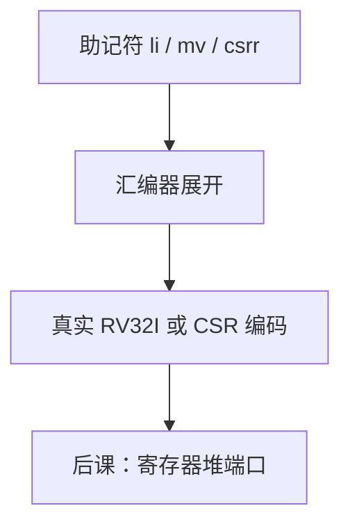

# 伪指令

汇编器把 `li`、`mv`、`csrr` 展开成一条或几条真实编码；硬件只看见 RV32I 与 CSR 指令，没有额外的 opcode。

<footer>—— 据 Patterson and Hennessy, Computer Organization and Design (RISC-V)；The RISC-V Instruction Set Manual, Volume I 整理</footer>

上一课[RISC-V CSR 与 ecall](/cs/riscv-csr-ecall)把真实系统指令钉进 ISA。[整数指令](/cs/riscv-int-isa)已声明 `li`/`mv` 是合成。本课不重讲 `ecall` 陷阱，也不从宏汇编语言另起。缺口是：程序员写的助记符与硬件执行的编码不是一一对应。后课寄存器堆只对**真实**的 `rs1`/`rs2`/`rd` 接线。

## 问题

`mv rd, rs` → `addi rd, rs, 0`。`li` 按常数宽度变成 `addi` 或 `lui`+`addi`。`nop` → `addi x0, x0, 0`。`csrr rd, csr` → `csrrs rd, csr, x0`。`j`/`jr`/`ret` 是 `jal`/`jalr` 的缺省寄存器写法。缺口不是新的数据通路，而是汇编器边界：反汇编可能看到展开后的真指令。

硬件没有 `li` 单元。把伪指令当 ALU 功能，单周期图会多出不存在的 MUX。

### 伪指令不是微码

CISC 微码在芯片内把复杂指令拆成内部步骤。RISC-V 伪指令在**汇编时**拆成程序员可见的真指令，每条仍一拍（或多拍取指）按 ISA 执行。两者都「拆」，层不同。

官方手册列出伪指令表。Patterson/Hennessy 用 `li`/`mv` 写例子。本课不把链接器的 `call` 远跳完整重定位写完，那是调用约定与链接课。

## 方法

列常用展开，核对字段仍落在上一课的格式里。宽立即数两拍：先 `lui` 高 20 位，再 `addi` 低 12 位，注意符号扩展对高位的借位调整。

## 机制

展开之后，多数整数指令仍是两读一写：两个源寄存器（或一个源加立即数）、一个目的。这正是[寄存器堆](/cs/register-file)要提供的端口。`jal` 写 `rd`、读 PC，稍有不同，仍是堆上的写口。CSR 指令多一个 CSR 口，通用堆端口不变。

## 边界

本课不把编译器优化、不把 `.macro` 用户宏当 ISA。压缩指令是另一编码，不是伪指令。

后课默认：谈到硬件，只存在真指令；助记符已展开。下一课实现 32×32 的多口堆。

## 小结

- 伪指令是汇编展开，无新 opcode。
- `li`/`mv`/`nop`/`csrr`/`ret` 都落成已有指令。
- 硬件端口按真指令的两读一写来做。
- 出处：Patterson and Hennessy, COD (RISC-V)；RISC-V ISA Manual, Vol. I。
