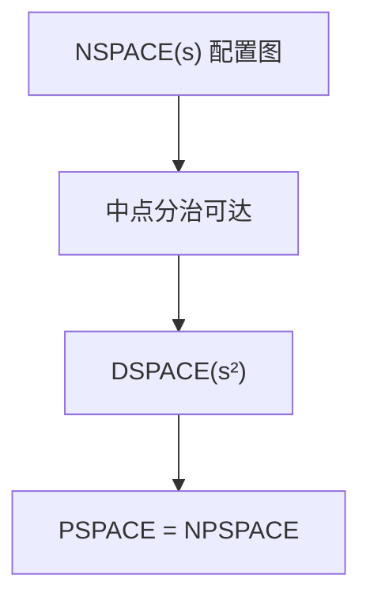

# PSPACE 与 Savitch

多项式空间可判定的语言构成 PSPACE；Savitch 用可达性的分治把非确定空间平方变成确定空间。

<footer>—— 据 Savitch, Relationships Between Nondeterministic and Deterministic Tape Complexities, 1970；Sipser 整理</footer>

上一课[时间层级](/cs/time-hierarchy)给时间分级。缺口是**空间**：工作带格数。PSPACE $= \bigcup_k \mathrm{DSPACE}(n^k)$。NPSPACE 看起来更大，Savitch 定理：$\mathrm{NSPACE}(s)\subseteq\mathrm{DSPACE}(s^2)$（$s\ge\log n$），于是 $\mathrm{PSPACE}=\mathrm{NPSPACE}$。主干 P/NP 没有这样的塌缩。

## 问题

配置图：顶点是 TM 配置（多项式空间时配置指数多）。非确定空间 $s$ 的接受 = 从起始配置沿边走到接受配置，路径长至多指数。Savitch：谓词 $\mathrm{CanYield}(c_1,c_2,t)$「$t$ 步内从 $c_1$ 到 $c_2$」对半枚举中间配置，递归深度 $O(\log t)=O(s)$，每层存一个配置 $O(s)$，总空间 $O(s^2)$。时间仍指数——空间算法可以很慢。

TQBF（带量词的布尔公式）PSPACE 完全，点名；证明形状像交替 $\exists\forall$，本课不写完归约。

### 空间可复用，时间不能

写过的格子能擦。故空间 $s$ 的时间上界 $2^{O(s)}$（配置数）。$P\subseteq\mathrm{NP}\subseteq\mathrm{PSPACE}\subseteq\mathrm{EXP}$，中间是否相等开放。Savitch 的平方对对数空间很痛：NL 是否等于 L 仍开，下一课。

Savitch 1970。Sipser 用可达性讲。Stockmeyer–Meyer 的 TQBF 完全性是 PSPACE 的 Cook 定理。本课要塌缩与配置图，不完全性证明。

## 方法

画配置图，写 $\mathrm{CanYield}$ 的递归。强调确定性模拟不枚举成功路之外的猜测内容——猜测写在配置里，递归只问可达。对照[多项式归约](/cs/np-reduction)：这里比较的是空间类等式，不是 NPC。

## 机制

PSPACE 完全问题（游戏、带量词布尔）直觉是「多项式深的博弈」。时间层级说明 EXP 更大；PSPACE 与 EXP 是否相等开放。不要把「指数配置」写成 PSPACE 不在 P 的证明——那只是上界。

线性空间、多项式空间的差别也层级化（空间层级几乎无对数因子），本课点名。

配置图的边可在多项式空间判定（模拟一步）。Savitch 并不把时间变成多项式：递归树仍指数。TQBF 完全性让「多项式深博弈」成为 PSPACE 的脸谱，对照 SAT 的「存在短证书」。$NP\subseteq PSPACE$ 因为证书可在多项式空间里逐位猜并擦掉。

## 边界

本课不证 TQBF 完全，不引入 IP（后课）。不把 Savitch 的平方改进到线性（未知）。后课默认：PSPACE $=$ NPSPACE；空间平方换确定。下一课对数空间 L 与 NL。

空间可擦、时间不能：这是 $PSPACE$ 能装下整份 NP 证书又装得下多项式深博弈的原因。平方代价在对数空间不可接受，故 $L$ 与 $NL$ 下一课单独开。

上一课留下的缺口在本课收口；「PSPACE 与 Savitch」进入后课词汇表后只引用。文献用来钉对象与边界，不把本课写成该主题的独立综述。

## 小结

- PSPACE 是多项式工作空间；时间可指数。
- Savitch：非确定空间平方即可确定化。
- $P\subseteq NP\subseteq PSPACE\subseteq EXP$，中间开放。
- 出处：Savitch, 1970；Sipser。
