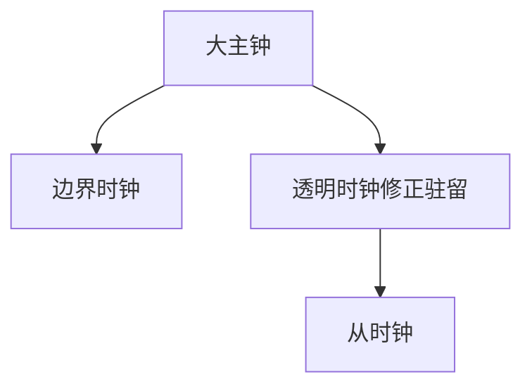

# PTP

PTP 用硬件时间戳与边界/透明时钟补偿交换延迟，把同步推进到微秒–纳秒，服务交易所与 5G RAN，不是 NTP 的换肤。

<footer>—— 据 IEEE 1588 PTP；ITU-T 电信剖面整理</footer>

[NTP](/cs/ntp) 到毫秒。[5G RAN](/cs/cellular-ran-core) 要更紧。[上一课](/cs/ntp) 的软件时间戳被内核与网卡抖动限制。缺口是 **PTP**：硬件戳、BC/TC。本课不把 FTP 写完。

## 问题

交易所、基站、数据中心快照要亚微秒。PTP：Sync/Follow_Up/Delay 消息，网卡在 PHY 打戳。边界时钟每跳重新主从；透明时钟把驻留时间写进修正域，避免交换机排队把 NTP 式估计毁掉——直接对应缓冲膨胀与 HOL。要全程支持，一条普通交换机就会毁掉精度。

不要把 PTP 写成区块链时间。

IEEE 1588。Profile（默认/电信/电力）选定时与消息率。本课不点名交易品种。

### 要全程硬件戳

透明时钟补偿驻留，普通交换机毁掉精度。服务 RAN 与机房，不服务随意公网主机。与 NTP 不是换肤。

## 方法

对照 NTP 软件戳 vs PTP 硬件戳。画：主时钟 → 支持 PTP 的交换 → 从时钟。与 URLLC：空口同步可源于同一时间底座。

方法止于选定对象与对照；机制才说它如何嵌入已有分层与主干课。

## 机制

RoCE 时间戳、Wi‑Fi TSF 是别的钟。安全：未认证 PTP 可被欺骗，要授时网络隔离。ECMP 不对称伤害 delay 测量，PTP 域常固定路径。卫星有传播，但地面 RAN 回传用光纤 PTP。

与容量无关：同步是控制，不是 $C$。

## 边界

本课不引入 White Rabbit 的全部。FTP 被动模式是下一课。后课默认：微秒级同步要 PTP 与支持的交换；NTP 不够。

在公网互联网上跑 PTP 没有 hop-by-hop 支持。

上一课留下的缺口在本课收口；「PTP」进入后课词汇表后只引用。文献用来钉对象与边界，不把本课写成该主题的独立综述。下一课[FTP 被动模式](/cs/ftp-passive)。

## 小结

- 硬件时间戳 + 交换补偿驻留。
- 全程 PTP 感知，否则退回 NTP 精度。
- 服务 RAN 与机房，不服务随意主机。
- 后课只引用本课钉死的对象，不从该领域总问题重开。
- 出处：IEEE 1588。
