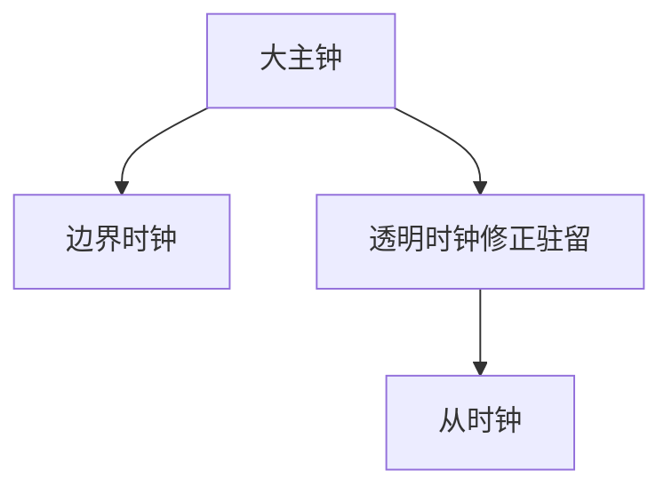
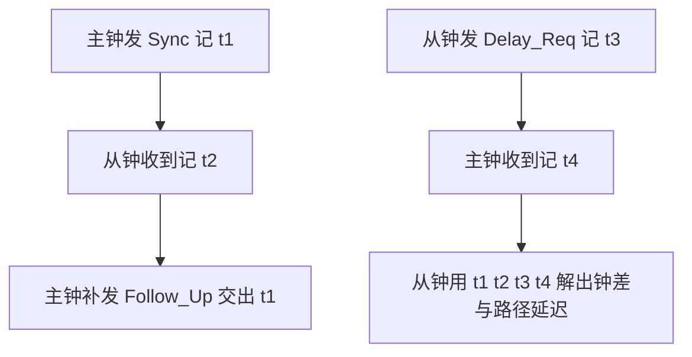

# PTP

PTP 用硬件时间戳与边界/透明时钟补偿交换延迟，把同步推进到微秒–纳秒，服务交易所与 5G RAN，不是 NTP 的换肤。

<footer>—— 据 IEEE 1588 PTP；ITU-T 电信剖面整理</footer>

[NTP](/cs/ntp) 到毫秒。[5G RAN](/cs/cellular-ran-core) 要更紧。[上一课](/cs/ntp) 的软件时间戳被内核与网卡抖动限制。缺口是 **PTP**：硬件戳、BC/TC。本课不把 FTP 写完。

## 问题

交易所、基站、数据中心快照要亚微秒。PTP：Sync/Follow_Up/Delay 消息，网卡在 PHY 打戳。边界时钟每跳重新主从；透明时钟把驻留时间写进修正域，避免交换机排队把 NTP 式估计毁掉——直接对应缓冲膨胀与 HOL。要全程支持，一条普通交换机就会毁掉精度。

不要把 PTP 写成区块链时间。

IEEE 1588。Profile（默认/电信/电力）选定时与消息率。本课不点名交易品种。

透明时钟的「修正域」像快递单上的中转记录：交换机在报文里补一句「在我这儿排队停留了 8.3 微秒」，从钟据此把这段驻留从延迟估计里扣掉。边界时钟则是另一种思路——干脆每台中转设备自己当分站钟，一跳一跳重新对时。

### 要全程硬件戳

透明时钟补偿驻留，普通交换机毁掉精度。服务 RAN 与机房，不服务随意公网主机。与 NTP 不是换肤。

## 方法

对照 NTP 软件戳 vs PTP 硬件戳。画：主时钟 → 支持 PTP 的交换 → 从时钟。与 URLLC：空口同步可源于同一时间底座。

```mermaid
flowchart TD
  GM["大主钟"] --> BC["边界时钟"]
  GM --> TC["透明时钟修正驻留"]
  TC --> SL["从时钟"]
```

## 机制

RoCE 时间戳、Wi‑Fi TSF 是别的钟。安全：未认证 PTP 可被欺骗，要授时网络隔离。ECMP 不对称伤害 delay 测量，PTP 域常固定路径。卫星有传播，但地面 RAN 回传用光纤 PTP。

```mermaid
flowchart TD
  M1["主钟发 Sync 记 t1"] --> S1["从钟收到记 t2"]
  S1 --> M2["主钟补发 Follow_Up 交出 t1"]
  S2["从钟发 Delay_Req 记 t3"] --> M3["主钟收到记 t4"]
  M3 --> R["从钟用 t1 t2 t3 t4 解出钟差与路径延迟"]
```

上图回答「钟差是怎么算出来的」：代入数字，$t_2 - t_1 = 1000$ ns、$t_4 - t_3 = 800$ ns，则平均路径延迟 $(1000+800)/2 = 900$ ns，从钟比主钟快了 $1000 - 900 = 100$ ns，照此微调本地钟即可。

初学者容易以为精度只由两端网卡决定。实际上中途一台普通交换机的排队抖动就有几十微秒，比微秒级目标高几个量级——这正是「一台混入的交换机毁掉全程精度」的原因，也是 ECMP 多路径要被固定掉的原因。

与容量无关：同步是控制，不是 $C$。

## 边界

本课不引入 White Rabbit 的全部。FTP 被动模式是下一课。后课默认：微秒级同步要 PTP 与支持的交换；NTP 不够。

在公网互联网上跑 PTP 没有 hop-by-hop 支持。

给个数的感觉：NTP 公网能做到毫秒（$10^6$ 纳秒）级，PTP 目标是亚微秒（$10^2$ 纳秒）级——差三四个数量级。这就好比一把尺子刻度到毫米，另一把到微米；量刻度的方式（软件读时钟 vs 网卡 PHY 硬件打戳）完全不同。

下一课[FTP 被动模式](/cs/ftp-passive)。

## 小结

- 硬件时间戳 + 交换补偿驻留。
- 全程 PTP 感知，否则退回 NTP 精度。
- 服务 RAN 与机房，不服务随意主机。
- 后课只引用本课钉死的对象，不从该领域总问题重开。
- 出处：IEEE 1588。
