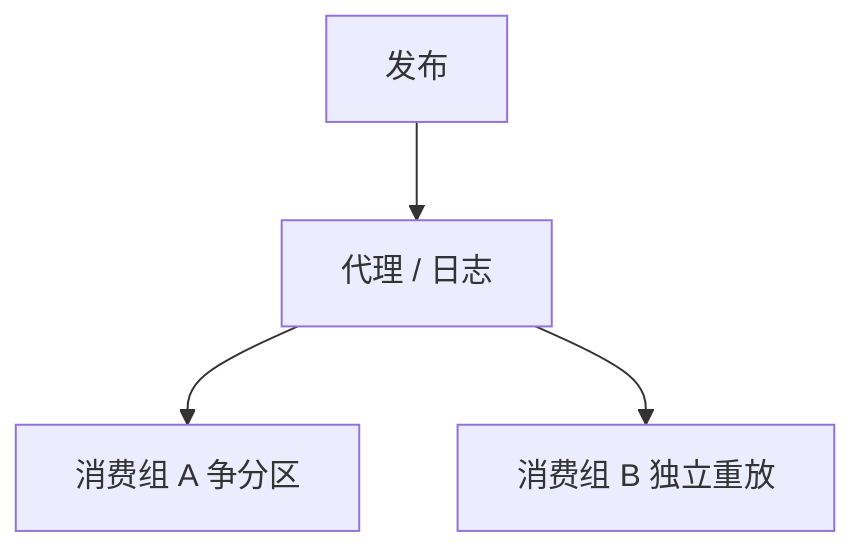

# 发布订阅

发布者与订阅者解耦：主题、兴趣、时间都可以解耦。排序与投递次数不随「pubsub」这个词附赠。

<footer>—— 据 Eugster, Felber, Guerraoui and Kermarrec, The Many Faces of Publish/Subscribe, CSUR 2003 整理</footer>

上一课[Kafka 日志](/cs/kafka-log)是带持久游标的一种 pub-sub。缺口是**模式本身**：主题、内容过滤、队列组消费。本课按 Eugster 的分类钉解耦轴，不把 Kafka 配置再抄一遍。后课缓存失效常误用 pub-sub 当可靠通知。

## 问题

三种解耦：空间（谁发布谁订阅不必相识）、时间（订阅者离线消息是否还在）、同步（发布是否阻塞到处理完）。实现：主题（topic）、内容（属性过滤）、类型。持久 vs 瞬态：ZK watch 瞬态；日志持久。

缺口：产品说 pub-sub 常默认「每条都送到、且有序」。规格上要分别买：持久日志、分区序、至少一次、消费者组互斥。没有买就只有尽力而为的广播。

CSUR 2003 是分类综述。Isis 的因果/全序广播是更强的通信原语，属于排序轴。

## 方法

选拓扑：扇出推、订阅者拉、中间 broker。过滤放发布侧还是订阅侧决定带宽。消费者组：同一逻辑订阅争分区，是队列；每组独立位移，是广播。两者都叫订阅，语义反。

与 RPC：RPC 是一对一同步请求；pub-sub 是一对多异步。用 pub-sub 模拟 RPC 要补相关 id 与超时，失败模式回到上一课。

## 机制

丢失：瞬态总线在订阅者重启时丢。重复：重连重放。乱序：多分区、多发布者无协调。缓存失效若用尽最大努力 pub-sub，会永久脏——下一课。

本课不写 MQTT/AMQP 帧。也不写社交信息流推荐。

背压：订阅者慢则代理堆积或丢掉。日志用磁盘换时间；内存总线用丢。选错会把发布者拖死或静默丢失效消息。

## 边界

本课不把所有消息产品对照表写全。后课默认：说到订阅，先问持久、序、组互斥、投递次数。缓存失效下一课说明「通知丢了怎么办」必须另有 TTL 或版本。

解耦不是保证。保证逐项买。

## 小结

- Pub-sub 解耦空间/时间/同步；序与次数另规格。
- 消费组互斥 vs 独立重放是两种语义。
- 瞬态 watch ≠ 持久日志。
- 出处：Eugster et al., CSUR 2003。
