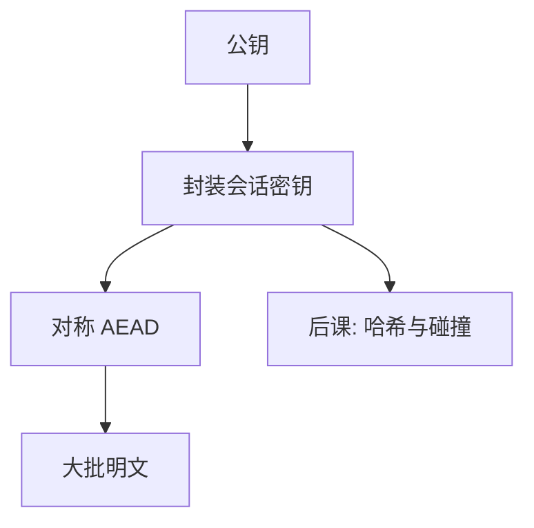

# 公钥与信封

公开的钥匙只能封上；打开或签名要用留下的那一半。会话仍用对称，公钥只运密钥。

<footer>—— Diffie and Hellman, New Directions in Cryptography, IEEE TIT 1976</footer>

[上一课](/cs/block-modes)给出 AEAD，前提是共享密钥已在。本课不重写 GCM。缺口是：第一次见面如何得到那把密钥，而不先有安全信道。公钥加密：公钥可公开，私钥保密。实践几乎总是**信封**：用公钥封装随机会话密钥，大数据仍走对称。

## 问题

对称密钥若靠事先邮寄，规模炸裂；若靠明文套接字传送，与不加密相同。Diffie–Hellman 1976 的方向是：公开算法与公钥，使没有预共享秘密的双方能得到共同密钥。RSA 一类公钥加密可直接封密钥。缺口不是数论课，而是混合加密这一层工程对象。

Goldwasser and Micali 要求公钥方案也有语义安全（随机化加密）。确定性公钥加密泄漏相等性，与 ECB 同类错误。

## 方法

信封：发送方抽会话密钥 $k$，用接收方公钥封装 $k$，用 $k$ 做 AEAD。DH/ECDHE：双方临时指数，得到共享秘密再派生 $k$，提供前向保密——长期私钥泄露不回溯旧会话。本课不写椭圆曲线方程，只锁定：长期密钥用于认证与封装，会话密钥短命。

## 机制

公钥运算贵，只保护几十字节的密钥；吞吐量仍在对称层。认证尚未解决：你封的是**谁的**公钥？中间人可以换成自己的公钥。那是证书课。本课只让「没有预共享对称键也能建会话」成立，身份绑定另做。

信封把公钥运算的次数压到每个会话几次，与消息长度解耦。

## 边界

不要把「公钥」写成「更安全的对称」。它解决分发与某些认证，不自动更强。也不把量子威胁写成已插入主干的算法更换课；后量子是附录级对照，本课仍用 DH/RSA 的机制角色。私钥一旦进内存，威胁模型回到「能读进程」。

封装失败（错误的 $pk$）会把会话键交给错误主体，这是认证缺口，不是对称层的锅。后课默认：会话用对称；公钥运密钥或做签名。抗碰撞哈希是签名与承诺的前置零件。

长期私钥的保护（HSM、权限、轮换）属于威胁模型里的端点，不是 DH 算术能代替的。

## 小结
- 前向保密依赖临时 DH，长期私钥泄露不回溯旧 $k$。
- 后课哈希为签名与承诺提供固定长摘要。

- 对称要共享密钥；本课用公钥信封与 DH 派生会话键。
- 大批数据仍 AEAD；公钥不替代对称。
- 身份与公钥的绑定尚未做；哈希先作为零件。
- 出处：Diffie and Hellman, 1976；对照 RSA；Goldwasser and Micali。
