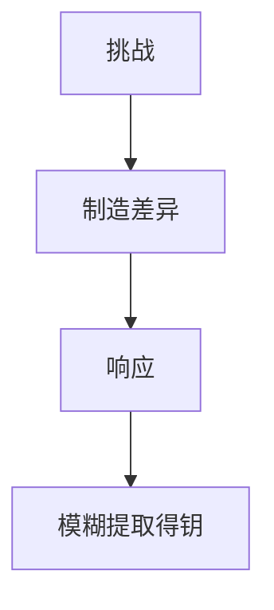

# PUF

物理不可克隆函数把制造差异变成挑战–响应：像指纹，难复制。它可作设备身份与密钥派生，但可靠性、老化与建模攻击要进合同。

<footer>—— Gassend, Clarke, van Dijk and Devadas, Silicon Physical Random Functions, CCS 2002</footer>

## 定位

上一课[故障](/cs/fault-injection)扰计算。缺口是**用物理差异当身份**而不是存密钥。本课 PUF 直觉，不写建模攻击步骤。

后课默认已经读完本课钉下的合同，只补差，不从该领域第一性原理重开。

## 问题

密钥要存 NVM，可被读出。PUF：挑战进、响应出，模糊提取得到稳定密钥。缺口是误码、温度、机器学习建模。

### 不是完善保密

PUF 是硬件身份候选，要模糊提取与限次挑战。

Gassend et al. 2002。禁止克隆实验。Spectre 缓解下一课回微结构。

## 方法

画挑战响应。对照 HSM 存钥。下一课 Spectre 缓解与代价。

图中节点是本课的机制骨架；课程不把图展开成可运行的攻击步骤。

## 机制

设备身份可不上电存储。微结构泄漏下一课是另一物理/共享硬件轴。

前提写进合同之后，游戏外的误用只当失败模式点名，不在本课写成操作程序。

## 边界

不写建模攻击。Spectre 缓解下一课。

## 小结

- 故障扰计算；PUF 用差异当指纹。
- 模糊提取把噪声响应收成密钥。
- 老化与建模要进威胁模型。
- 下一课 Spectre 缓解。
- 出处：Gassend, Clarke, van Dijk and Devadas, 2002。
