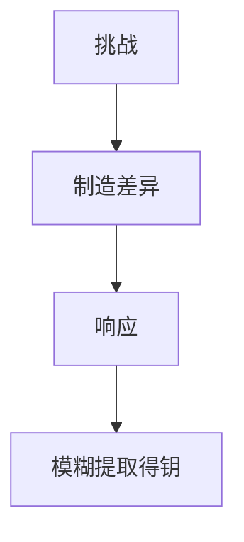
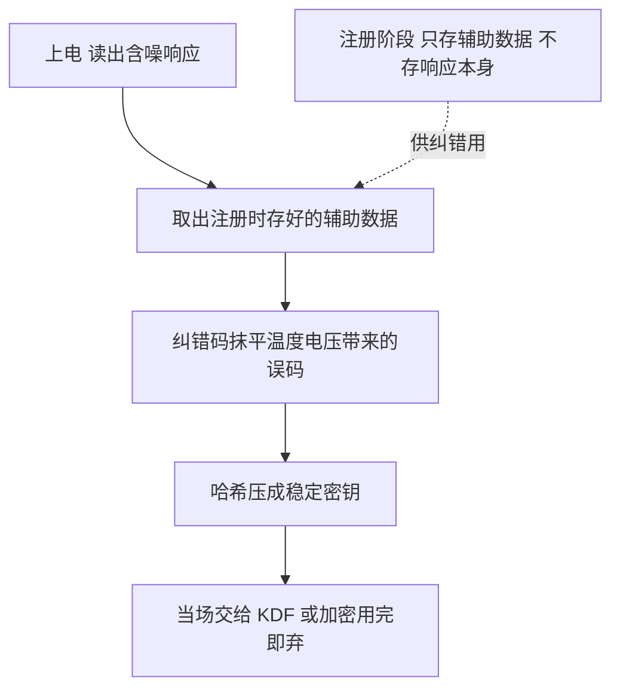

# PUF

物理不可克隆函数把制造差异变成挑战–响应：像指纹，难复制。它可作设备身份与密钥派生，但可靠性、老化与建模攻击要进合同。

<footer>—— Gassend, Clarke, van Dijk and Devadas, Silicon Physical Random Functions, CCS 2002</footer>

上一课[故障注入](/cs/fault-injection)用物理手段扰动计算；本课反过来看：**把制造时的物理差异本身当作身份**，替代把密钥存进存储器。本课讲 PUF 直觉，不写建模攻击的步骤。

后课默认已经读完本课钉下的合同，只补差，不从该领域第一性原理重开。

## 问题

密钥存进非易失存储就有被读出的一天——拆封、探针、冷启动都能碰它。PUF 不存：施加挑战，硅片的制造差异（走线延迟、SRAM 上电偏好）决定响应，同一芯片给出稳定输出而其他芯片无法复制；再经模糊提取把含噪响应收成稳定密钥。缺口有三类：响应误码随温度电压漂移、芯片老化改变响应、公开挑战–响应对喂给机器学习后被建模仿冒。

### 不是完善保密

PUF 是硬件身份的候选方案，不是完善保密：没有模糊提取与限次公开挑战，响应表迟早被学穿。

Gassend et al. 2002。禁止克隆实验。Spectre 缓解下一课回微结构。

SRAM 上电指纹的直觉：每个存储单元上电时「倒向 0 还是 1」由制造时的微小差异随机定型，像出厂就长好的指纹。同一片芯片次次上电指纹基本一致，换一片就对不上——于是「身份」不需要存任何地方，上电瞬间自己重印一遍。

## 方法

方法是把挑战–响应图画清楚，再对照 HSM 存钥：HSM 把密钥封进抗拆外壳，代价是管一个「读不出」的黑盒库存；PUF 的密钥按需从物理派生，不上电就不存在，代价是管误码率与老化。下一课 Spectre 缓解与代价。

```mermaid
flowchart TD
  CH["挑战"] --> PHY["制造差异"]
  PHY --> RSP["响应"]
  RSP --> FE["模糊提取得钥"]
```

## 机制

机制的核心是「身份可以不上电存在」：制造差异在断电时也在，密钥只在需要的一刻被提取，攻击面从「读出存储」变成「预测物理」。模糊提取由纠错与哈希两截组成——辅助数据帮纠偏但不泄露密钥本身；老化则要在生命周期里重登记。微结构泄漏下一课是另一条物理/共享硬件轴。

```mermaid
flowchart TD
  PWR["上电 读出含噪响应"] --> AU["取出注册时存好的辅助数据"]
  AU --> EC["纠错码抹平温度电压带来的误码"]
  EC --> H["哈希压成稳定密钥"]
  H --> USE["当场交给 KDF 或加密用完即弃"]
  REG["注册阶段 只存辅助数据 不存响应本身"] -.供纠错用.-> AU
```

上图回答「模糊提取怎么把噪声响应收成同一个密钥」：注册时只留辅助数据，像给指纹留一张「哪里容易认错」的说明；此后每次上电先纠错、再哈希。响应本身从头到尾没有被存储，读存储的攻击面落了空。

## 边界

不写建模攻击的步骤；边界要点名：PUF 的可靠性用片内误码率衡量，典型为个位数百分比，正是这个量级的噪声决定了必须配模糊提取。Spectre 缓解下一课。

给个数的感觉：误码率 5% 时，一段 128 位的响应每次上电约有 6 个位翻转。人眼看它仍是「同一枚指纹」，但密钥差一位都全错——纠错码就得按「6 位错」来配容量，这正是辅助数据存在的理由。

初学者容易把「物理不可克隆」听成「攻不破」。若公开足够多挑战–响应对，机器学习能拟合出一个软件替身来冒充芯片——所以真正的合同是：挑战限次公开、响应表不出设备，再谈不可克隆。

## 小结

- 故障扰计算；PUF 用差异当指纹。
- 模糊提取把噪声响应收成密钥。
- 老化与建模要进威胁模型。
- 下一课 Spectre 缓解。
- 出处：Gassend, Clarke, van Dijk and Devadas, 2002。
