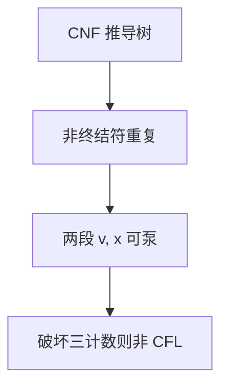

# CFL 泵引理

足够长的上下文无关串，推导树上有可重复的树枝：两段子串可同时泵；破坏这对计数，就不是 CFL。

<footer>—— 据 Bar-Hillel, Perles and Shamir, 1961；Sipser 整理</footer>

上一课[下推自动机](/cs/pushdown-automata)把 CFL 钉在单栈上，并点名 $a^nb^nc^n$ 像是两根计数器。本课不重做 PDA 转移。缺口是负向工具：CFL 泵引理（以及何时必须用 Ogden）。正则泵是一段 $y$；这里是两段 $v,y$，对应树上一条可重复路径。

## 问题

CNF 文法下，足够长的串的推导树必有一条长路径，某非终结符 $A$ 重复。把上下两段切成 $uvwxy$，可泵 $uv^iwx^iy$。条件：$|vwx|\le p$、$|vx|\ge 1$。若对一切这种切法都能选 $i$ 使结果掉出 $L$，则非 CFL。

$\{a^nb^nc^n\}$：泵只能动两种字母的计数（$vwx$ 短），第三种对不上。$\{ww\}$ 更滑，标准泵可能失败，Ogden 给位置打标记。本课以 $a^nb^nc^n$ 为主靶。

### 仍不是充要

可泵的不必是 CFL。引理方向是 CFL $\Rightarrow$ 可泵。封闭性（与正则交仍 CFL）常与泵合用：先切出切片再泵。

Bar-Hillel et al. 同时给了正则与 CFL 泵。Sipser 强调 $v,x$ 可以在串的两端。Ogden 1968 是加强版，本课点名不证。

## 方法

取 $p$ 为泵长度，$w=a^pb^pc^p$。对手切 $uvwxy$，讨论 $v,x$ 覆盖哪些字母块：若只覆盖一种或两种，泵 $i=2$ 破坏三者相等；不能三种都覆盖因为 $|vwx|\le p$。不要用正则泵去泵 CFL——一段 $y$ 不够同时动两处。

与正则交封闭：CFL $\cap$ 正则仍 CFL。证 $\{a^nb^nc^n\}$ 常直接泵；证更脏的语言可先交 $a^*b^*c^*$。

## 机制

树的可重复对应栈上一段「推然后弹」的周期。单栈只有一层这样的配对，所以两个独立配对（$a^n b^n c^n d^n$ 的另一种切法）也会失败。泵引理把「栈的局限」写成串上的组合陈述，不必画自动机。

二义性与是否 CFL 无关：固有二义语言仍是 CFL，泵不谈树是否唯一。

Ogden 引理允许你指定「要泵的位置」，用来打 $\{ww\}$ 一类标准泵失败的例子。本课不写它的证明，只提醒：泵失败不等于是 CFL。CFL 与正则的交仍是 CFL，因此可先用正则「切出」$a^*b^*c^*$ 再泵，避免串的其它垃圾破坏计数。

## 边界

本课不证 Parikh 定理，不把 Ogden 全文写下。不引入 CSL 的泵。后课默认：排除 CFL 先泵 $a^nb^nc^n$ 型；成员判定是另一回事——下一课 CYK。

CFL 泵的两段 $v,x$ 对应树上一次可重复。单栈只能「一对」计数一起动，三计数因此是标准靶。成员判定不是本课任务，下一课 CYK 才接收。

## 小结

- CFL 长串可同时泵两段；$a^nb^nc^n$ 是标准非 CFL。
- 与正则交仍 CFL，可先切片再泵。
- 可泵不是充要；Ogden 是加强。
- 出处：Bar-Hillel, Perles and Shamir, 1961；Sipser。
