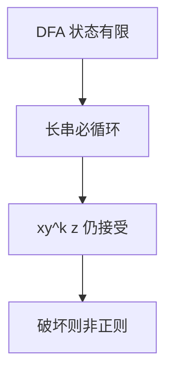

# 正则语言泵引理

正则语言里足够长的串，必有一段可被抽成任意多次，语言仍收下；找不到这样的分解，就不是正则。

<footer>—— 据 Bar-Hillel, Perles and Shamir, 1961；Sipser, Introduction to the Theory of Computation 整理</footer>

上一课[Chomsky 层级](/cs/chomsky-hierarchy)把正则放在 3 型，并声明负向证明留给本课。本课不重画包含链，也不重做[NFA 与 DFA](/cs/nfa-dfa)的子集构造。缺口是：**怎样证明某个具体 $L$ 不是正则**——泵引理是最常用的必要性质，不是刻画。

## 问题

正向：给 DFA 或正则式，即证正则。负向：语言无穷，不能逐串检查。DFA 只有 $|Q|$ 个状态，长于 $|Q|$ 的接受串必在某状态上循环。抽出循环对应的子串 $y$，泵 $xy^kz$ 仍走同一环。若某 $L$ 对一切候选分解都能找出一个 $k$ 使 $xy^kz\notin L$，则 $L$ 非正则。

标准例子：$\{a^nb^n\mid n\ge 0\}$。主干 CFG 课用括号匹配当「正则做不到」的直觉；本课把这句收成引理应用，不再谈记号流。

### 泵引理不是充要条件

满足可泵的语言不必正则。引理是「正则 $\Rightarrow$ 可泵」。证非正则用逆否。有些非正则语言狡猾地可泵，要用 Myhill–Nerode 或封闭性，那是后课。

Bar-Hillel–Perles–Shamir 给出泵引理的经典形式。Sipser 用博弈语言：对手给 $p$，你给 $w$，对手切 $xyz$，你选 $k$。写证明时不要漏量化顺序。

## 方法

固定泵长度 $p$。选 $w\in L$、$|w|\ge p$（通常取最能破坏计数的那条）。对任意满足 $|xy|\le p$、$|y|\ge 1$ 的分解，指出某个 $k$（常取 $0$ 或 $2$）使 $xy^kz\notin L$。计数论证：循环落在 $a$ 段则 $a,b$ 个数不再相等。

不要把 $\{ww\mid w\in\{0,1\}^*\}$ 强行用本课引理硬泵——它更自然是后课 CFL 泵或不封闭的材料。本课把 $a^nb^n$ 与 $\{a^{n^2}\}$ 一类做完即可。

## 机制

引理依赖**有限记忆**：循环是同一状态重访。若允许栈，同一串可以不被这段 $y$ 破坏，所以 CFL 需要另一条泵引理。本课不提前写 Ogden。

词法器仍可识别标识符；泵的是语言类，不是「DFA 实现得笨」。有限语言都正则，泵引理对有限 $L$ 真空成立（取 $p$ 大于最长串）。

泵长度 $p$ 依赖于语言（或 DFA 状态数），不依赖于你选的那条 $w$ 之外的参数：先有 $p$，再选 $w$。写反了量化，证明是错的。词法器识别的标识符语言正则，泵不了「任意层括号」；那是下一层 CFG 的事，不要用本课引理去泵程序语法。

## 边界

本课不证 Myhill–Nerode，不用封闭性证非正则（下一课最小化之后才把封闭当工具使）。不把泵引理写成算法：选 $w$ 需要人。后课默认：要从正则里排除，先尝试泵；失败再换等价类。

写证明时把「存在 $p$」放在最外层，再选 $w$，再应付所有切法。量化一乱，泵引理就变成错的组合游戏。后课 Myhill–Nerode 在泵失败时接棒。

## 小结

- 正则 $\Rightarrow$ 长串可泵；逆否用于排除。
- 量化顺序是对手与你的博弈；$a^nb^n$ 是标准靶。
- 可泵不是正则的充要条件。
- 出处：Bar-Hillel, Perles and Shamir, 1961；Sipser。
