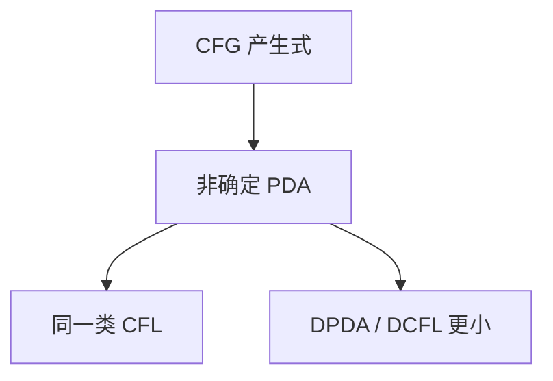

# 下推自动机

有限控制加上一根栈：读输入、换栈顶，恰好认上下文无关语言；确定下推机严格更弱。

<footer>—— 据 Chomsky, 1962；Hopcroft and Ullman；Sipser 整理</footer>

上一课[正则封闭性](/cs/regular-closure)把 3 型语言的运算收齐，并指出 CFL 不再对补、交关闭。主干[CFG](/cs/cfg-grammar)已有产生式与推导树，但机器一侧还停在 DFA。缺口是**下推自动机（PDA）**：给 CFG 配上栈，并登记与 2 型等价。

## 问题

括号匹配、$a^nb^n$ 需要记住尚未关闭的计数，有限状态不够，无限计数器又太强。栈是折中：只动顶端。PDA：$\delta(q,a,X)$ 给出有限个 $(p,\gamma)$，用 $\gamma$ 替换栈顶 $X$；$a$ 可以是 $\varepsilon$。接受：读完输入且栈空，或进入接受态——两种定义等价（可互译）。

CFG $\to$ PDA：用栈模拟最左推导。PDA $\to$ CFG：变量记「从 $p$ 带着栈底 $X$ 走到 $q$ 且弹出 $X$」。本课要等价的形状，不把构造的每一条产生式写完。

### 确定 PDA 不是「DFA 加栈」那么强

DPDA 的语言类 DCFL 真包含于 CFL：$\{ww^R\}$ 是 CFL 经典例子，确定机难以在中点翻栈。编程语言的 LR 家族落在 DCFL 附近；一般 CFG 需要非确定或更重的分析。主干[LR](/cs/lr-shift-reduce)用移进归约，直觉就是确定栈，本课不重做分析表。

Chomsky 把 CFG 与「下推」对应。Sipser 用接受态定义；Hopcroft–Ullman 常强调空栈接受。非确定是语言类的一部分，不是实现 bug。

## 方法

画认 $a^nb^n$ 的 PDA：读 $a$ 压栈，读 $b$ 弹栈，恰空则接受。指出交 $a^nb^nc^n$ 需要两条独立计数，单栈做不到——这为泵引理课埋伏。乘积机对 PDA 不保 CFL：栈无法同时维护两套无关符号。

正则是 PDA 不真正用栈（或栈高有界）的特例。不要把 PDA 写成图灵机的「只许用栈」限制——图灵机还没有定义。

## 机制

栈给出后进先出的嵌套，对应推导树的递归。二义 CFG 对应多条接受路，不是多根栈。 $\varepsilon$ 转移用于结束推导、弹出剩余；词法课的 $\varepsilon$ 边同一语法，对象换成栈符号。

CFL 对并、连接、星封闭（文法侧显然），对交、补不封闭（与 $a^nb^n\cap a^nb^nc^n$ 相关）。本课点名，证明细节可放到泵引理之后。

栈符号表是有限的，无穷来自栈高。这与计数器机器不同：计数器没有「把符号埋住再挖出」的名字，只有整数。CFG 的递归非终结符对应压栈；$arepsilon$ 产生式对应弹空。确定 PDA 的语言对补封闭，一般 CFL 不——这是 DCFL 真小的另一面。

## 边界

本课不写 CYK，不证 $a^nb^nc^n$ 非 CFL（下一课泵）。不引入双栈机器——双栈已经图灵完全，那是后课。后课默认：CFL $=$ 非确定 PDA 的语言；DCFL 真小。下一课给 CFL 负向引理。

## 小结

- PDA = 有限控制 + 栈，与 CFG 认同一类。
- 非确定本质；DPDA 更弱。
- 单栈不能同时维护两套独立计数。
- 出处：Chomsky；Hopcroft and Ullman；Sipser。
