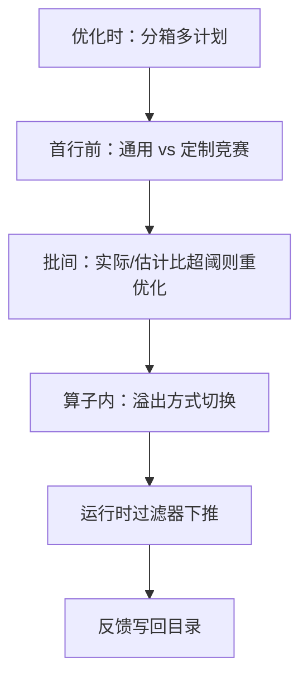
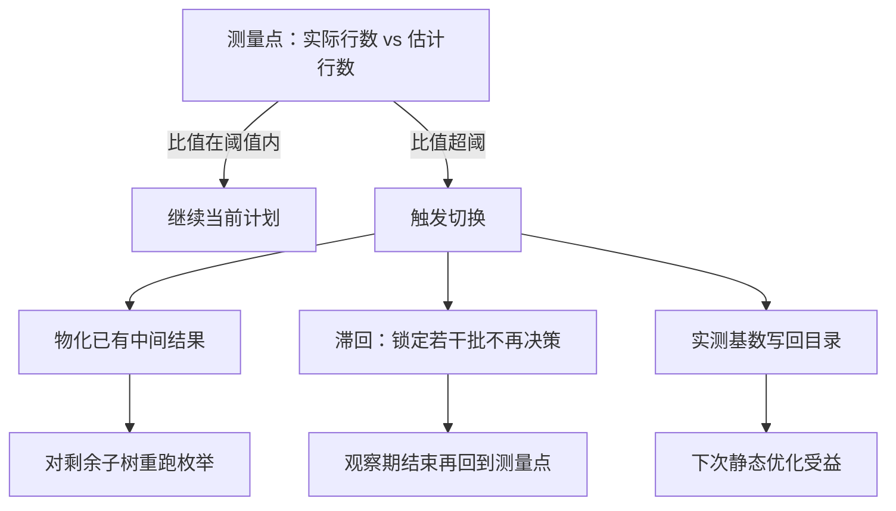

# 自适应执行

静态优化赌估计全对；自适应是给赌局加止损——在执行流的某个决策点允许改主意，而每次改主意都要付重新决策的税。

<footer>—— 据 Kabra and DeWitt, 1998；Avnur and Hellerstein, 2000；Markl et al., 2004 整理</footer>

[上一课](/cs/qo-plan-space)把静态空间收口：搜得再好，数字错了还是选错树。主干 [自适应查询处理](/cs/adaptive-query-processing) 立了「监测—重优化」框架，[学习型优化器](/cs/learned-optimizer) 管跨执行的记忆。本课深化单次执行内的工程谱系：决策点放在哪、能切换哪些东西、怎么防抖动与缓存放大。

## 问题

错有三种来源，纠偏点各不相同。参数错：同一句 SQL，主键点查与全表扫描共用一个通用计划，谁都跑不好。数据错：统计过期或倾斜，中间基数爆表。资源错：并发挤压，内存预算被砍，原计划选好的溢出方式不再合适。决策点沿时间轴展开：优化时（按参数重编译）、首行前（在候选计划里挑）、管道批间（发现误差换算子）、算子内（溢出方式与并行度）。乱放决策点的代价是切换税：已建的哈希表作废、编译重跑、中间结果物化；阈值太松救不了火，太紧则两个计划来回横跳，比不切还慢。

## 方法

参数敏感：把参数取值空间分箱，每箱存一个计划，执行时按参数落箱选计划——把「一次窥视定终身」改成「按类窥视」。通用与定制竞赛：前几次执行用定制计划，累计若干次后比较定制计划平均代价与通用计划代价，通用更便宜才切换。执行中重优化：在测量点比较实际与估计行数，比值超阈（如一个数量级）则物化已有中间结果，对剩余子树重跑枚举；正确性合同是同一快照、同一指称。算子内自适应：hybrid hash 在 build 中途发现超预算，就地转分区溢出，不惊动优化器。运行时过滤器：build 侧生成的布隆与取值范围下推到尚未执行的 probe 扫描，让后面的算子提前瘦身——这是静态计划上长出来的跨算子动态信息边，与 join 实现课的布隆同源，但强调「运行时生成、按本次数据现做」。

## 机制

防抖动靠滞回：切换后锁定若干批，观察期不计入决策，避免在两个计划间振荡。反馈要写回：本次救火测得的实际基数进目录或反馈文件，让下一次静态优化受益；只救当次、不喂统计，等于同一个坑每天掉一次。成本核算定开关：短查询的监测与重优化税常超过执行本身，自适应是长管道的保险，不是全局默认——主干口径再次成立。缓存与自适应的接口：切换若发生在预编译语句上，改变的是本次执行的计划选择，缓存条目本身只在反馈写回后才更新。

PostgreSQL 的预编译语句缓存：前五次执行用定制计划，之后比较定制计划平均代价与通用计划代价，通用更便宜才切换；`plan_cache_mode` 可强制 auto、custom 或 generic。「竞赛」是写进源码的机制，不是比喻。

「参数分箱」就是把参数的取值范围切成几档（比如预估行数 0–100、100–1 万、1 万以上各一档），每档预先准备一份最合适的计划；执行时看参数落在哪一档，就拿哪一份计划，而不是拿一份「通吃」的计划硬套所有情况。

「比值超阈」可以代入具体的数：估计中间结果 1 万行、实际跑出 12 万行，比值 12 倍，超过 10 倍（一个数量级）的阈值，于是物化中间结果并对剩余子树重新枚举；若实际只有 1.2 万行，比值 1.2 倍，付一次切换税就不划算，继续跑。

初学者容易以为自适应是「免费纠错」——实际上每次改主意都要交税：已建好的哈希表作废、剩余子树重新优化、中间结果多一次物化。所以短查询宁可赌一份静态计划，自适应只留给长管道当保险。

## 边界

逐元组路由的 eddy 在生产 OLTP 里少见：逐元组决策的开销太大，本课点名不展开。提示与计划基线是反自适应的运维工具——DBA 冻结计划时，本课所有机制让位，两套机制要能共存而不互踩。自适应救的是单次执行；跨执行的记忆与漂移归学习型优化器，主干已讲。

## 小结

- 参数、数据、资源三类错对应不同决策点；切换有税，位置决定收益。
- 参数分箱与通用/定制竞赛治参数窥视；测量点重优化治数据错。
- 算子内切换与运行时过滤器是便宜的止损，不必惊动优化器。
- 滞回防抖，反馈写回喂下次；短查询默认关闭。
- 出处：Kabra and DeWitt, 1998；Avnur and Hellerstein, 2000；Markl et al., 2004。
