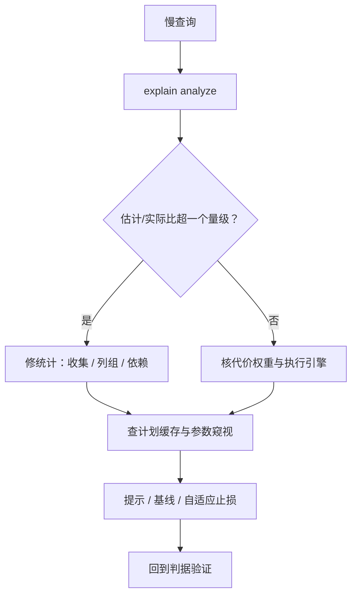

# 查询优化案例与收束

诊断慢查询的顺序不该由直觉决定：先核对数字，再核对尺子，再核对空间，最后才轮到「换个写法」。

<footer>—— 据 Chaudhuri, An Overview of Query Optimization, 1998；Graefe 查询执行综述；本课程口径整理</footer>

[上一课](/cs/qo-materialized-views)把优化外置到存储。本课收束：用两个案例把代价模型、join 实现、统计、空间、自适应、向量化、物化串成一条诊断链，再给出课程地图。本课程到此收束。

## 问题

两个高频事故，症状都是「忽然慢」。案例一：同一句 SQL 昨天八十毫秒今天八秒。案例二：大表连接把内存打爆，磁盘读抖动。缺口不是「优化器有 bug」，而是诊断没有顺序：直觉先去改写 SQL，把病因留在原地，换个参数再犯一次。诊断链的每一环都对应本课程的一课，每一环都要有可验证的判据——「感觉优化器傻」不是判据。

## 方法

案例一的链条。第一步 explain analyze：逐节点对比估计行数与实际行数，比值超一个数量级记为可疑——数字先于一切。第二步查统计：批量变更后是否没触发收集，相关列是否缺[列组统计](/cs/qo-statistics)，函数依赖是否声明。第三步查尺子：执行引擎或参数是否变过、代价权重是否失配——固定真实基数、只改权重的对照实验能把「统计错」与「权重错」分开，这是校准课的手法。第四步查缓存：参数窥视是否把坏计划锁死，通用与定制的竞赛是否选错边。修复按侵入度递增：刷统计、补统计、加[提示](/cs/plan-hints-stability)或计划基线。案例二的链条。先看执行器：build 侧是否选错（低估所致）、是否已转分区溢出、溢出分区数多少。短期用提示指定 build 侧或加内存预算止血；中期修统计让估计回轨；长期靠[自适应执行](/cs/qo-adaptive-execution)的止损——运行时过滤器把 probe 侧提前瘦身，算子内切换让溢出方式自适应。每层修复都回到判据：估计/实际比、布隆过滤率、溢出分区数，由数字说话。

## 机制

两个案例共享同一结构：优化器是估计驱动的搜索，任何一环失真都表现为计划变坏，所以诊断必须沿数据流逆行——从执行（实现常数）退到计划（空间与代价），再退到输入（统计）。跳环诊断——不比估计直接改写 SQL——多数时候是在给症状化妆。归档口径：每个案例四行——症状、判据、修复、验证。死因写「统计过期低估三百倍，build 侧选错致溢出」，不写「优化器抽风」；判据可检索，下次排查从数字开始。案例的死因要落在判据上，这是整门课程的方法论：每一课都留了测量点——代价模型给询价接口，join 实现给缓存与溢出计数，统计给摘要刷新记录，空间给枚举预算与超时行为，自适应给监测阈值，向量化给宽度与压缩域执行，物化视图给匹配率与刷新代价。慢的病因几乎总落在其中一格。

## 边界

本课不覆盖跨节点的诊断（shuffle、时钟与副本），也不覆盖锁等待与缓冲池的病因——那分别是分布式事务与存储进阶的领地，主干已立。学习型优化器与自动物理设计顾问是两条已在主干点名的延伸线。本课程到此收束，把「模型、输入、空间、止损、执行、外置」六个词留在地图上：读数、对尺、搜空间、加止损、摊批、外置存储，就是查询优化的全部日常。

## 小结

- 诊断沿数据流逆行：先估计/实际比，再统计，再尺子，最后才是改写。
- 每层修复配一个判据；没有判据的修复是化妆。
- 八课一线：询价、实现常数、摘要输入、空间搜索、执行止损、批摊销、存储外置。
- 案例同模板归档，死因落在判据，下次可检索。
- 出处：Chaudhuri, 1998；Graefe 综述；本课程各课口径。
