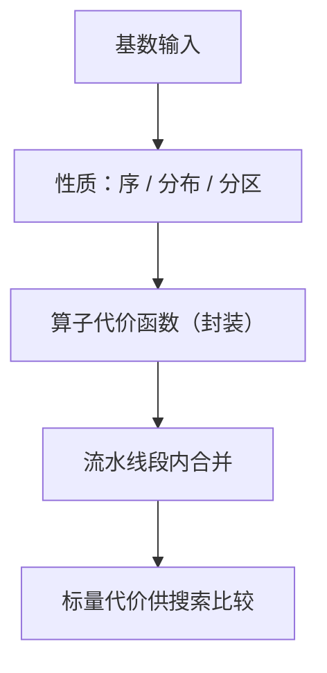
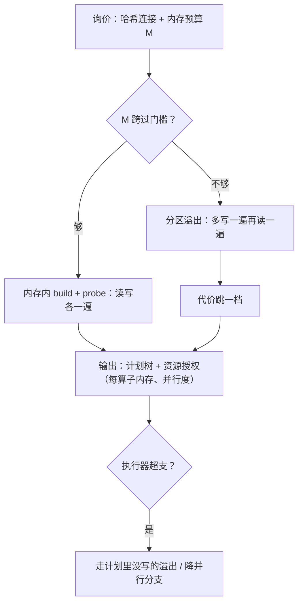

# 代价模型

代价模型不是毫秒预测器，它只欠一个回答：两个候选里哪个先跑。把「序」做对，「数」错一点可以原谅；把序做乱，再准的数也没用。

<footer>—— 据 Selinger et al., 1979；Graefe and McKenna, The Volcano Optimizer Generator, ICDE 1993 整理</footer>

[上一课](/cs/con-perf-map)给「分布式共识深化」收束：不碰安全的优化与声明降档各立一栏，混栏即走私；一轮多数派确认是提交延迟的地板，租约是摊销不是取消。回到单机的查询优化：再往前，[代价估计](/cs/cost-estimate)给过树上可加的 I/O/CPU 公式，[Selinger 动态规划](/cs/selinger-dp)用这把尺子驱动搜索。本课开始「查询优化深化」课程：把代价模型本身当工程对象——算子代价怎么封装成接口，内存与溢出怎么进公式，模型要满足哪些不变量才敢被动态规划使用。后课默认已经读过本课。

## 问题

主干公式回答的是「一棵给定的树花多少」。优化器要回答的是反问题：空间里成千上万棵树、每节点还有若干算法候选，如何一一询价且可比较。这不是再加几条公式，而是三个结构要求。其一，代价必须**分解**：整树代价由子树代价拼出，否则枚举无法剪枝。其二，算子代价必须**封装**：每个算子自己声明「给我什么输入与参数，我花多少、产出什么性质」，搜索器不必认识算子内部。其三，代价要依赖**性质**而不只是基数：同样十万行，有序与无序、已哈希与未哈希，后续算子的花费完全不同。缺了这三条会错在哪：若某算子的代价偷偷依赖兄弟子树（如「缓冲池反正热着」的全局假设），子问题的最优解拼不出整体最优，动态规划的最优子结构破产，「最优」失去定义。

### 一条哈希连接的账

以等值连接为例：内存够时 build 一遍读加建表、probe 一遍读，CPU 项按两输入行数乘每行哈希与比较；内存不够则走分区，多出写与再读各一遍。于是这条连接的代价是内存预算 $M$ 的函数：预算跨过门槛，代价跳一档。优化器不能只问「选什么算法」，还要问「给它多少内存」——预算是计划的一部分。

量级感：机械盘一次随机读约十毫秒，顺序吞吐约百兆字节每秒；NVMe 把随机读压到百微秒量级。同一套公式在两个时代里，$W_{\mathrm{io}}$ 相差两个数量级——公式不动、常数重校，这正是校准课与本课的分工。

## 方法

把每个算子写成纯函数：输入（子计划、基数、性质集合、参数），输出（标量代价、输出性质）。扫描的代价是页数乘顺序权重；索引探测是树高加匹配叶数乘随机权重；归并连接先问输入是否已有序，有序则只剩一遍归并；哈希连接按上面的分段函数。CPU 项按行数乘每行操作数，与 I/O 项加权相加。流水线要合并计账：选择、投影、表达式求值常与扫描在同一段流水线里共享一遍数据，阻塞点（排序、哈希 build）才是物化点——同一段内不重复计账，按段汇总。

性质随输出声明：是否按某键有序、是否已按键哈希分区、是否去重。这些是后续算子询价的输入，也是「同一子集保留多条计划」的原因——有趣序不是附属标签，而是代价函数的参数之一。

## 机制

封装的价值在扩展：搜索器只与「代价函数加性质推导」这个接口打交道，新算子、新存储接入时不改枚举逻辑——Volcano 一系优化器生成器把这写成设计原则，Cascades 系实现沿用至今。工程不变量有三条。局部性：子计划代价只依赖自身与其声明的性质，不依赖兄弟；一致性：同一算子、同一输入、同一参数，任何时刻询价给同一个数，否则同一轮枚举里的两个决策用了两把尺子；序导向：模型只需相对序正确，绝对值不可信，校准课已把目标定在这里。

内存预算进公式有个推论：优化器输出的不止一棵树，还有一串资源授权（每算子内存、并行度）；执行器超支时走的溢出、降并行分支是计划里没写的部分，自适应执行课收拾这里。

术语翻译：「询价接口」就是每个算子对外挂一个报价函数——你给我什么输入（行数、是否有序、给多少内存），我就报一个价（代价数字）。搜索器不需要懂算子内部怎么干活，只拿着报价单比价，这正是「封装」的含义。

数字实例：设 build 侧 1000 页、probe 侧 1000 页。内存够时代价约 2000 页读；不够时要多写 2000 页再读回 2000 页，合计 4000 页——预算一跨过门槛，代价直接翻倍。「代价是预算 $M$ 的函数」就是这种台阶形，而不是平滑曲线。

常见误区：初学者常把代价模型报的数当成「预计运行 3.2 秒」这类真实毫秒预测。实际上它只承诺相对序正确——A 比 B 便宜这个判断可信，绝对数值不可信；报 100 和报 300 的两个计划，真实耗时未必是 1:3。

## 边界

本课不回答基数从哪来——统计信息课的题目；也不在执行中途改计划——自适应执行课处理。代价模型的天花板由执行引擎决定：引擎换了向量化内核而模型仍按逐行计账，两边口径就对不上，校准课已点名。学习型方法修的是模型输入与权重，结构不变；本课仍是白盒。

## 小结

- 代价模型是询价接口：分解、封装、依赖性质，三者撑起动态规划的最优子结构。
- 阻塞点是物化点；流水线段内合并计账，避免重复收费。
- 内存预算是计划的一部分，代价是预算的函数。
- 模型只欠相对序；绝对毫秒不可信，常数靠校准。
- 出处：Selinger et al., 1979；Graefe and McKenna, 1993；主干代价估计与校准课。
