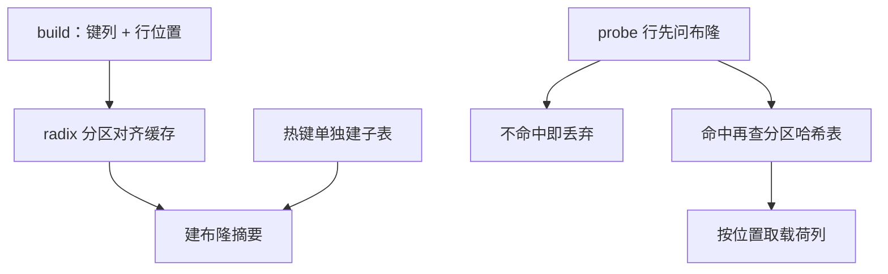

# join 算法的实现

哈希连接的快慢不在算法名里，而在 build 侧落进哪级缓存、分区写几遍、探针白问几次。同一个「分区哈希」，常数可以差数倍。

<footer>—— 据 Boncz, Manegold and Kersten, 1999；Graefe 查询执行综述整理</footer>

[上一课](/cs/qo-cost-model)把算子代价封装成询价接口，也承认接口之下的常数由实现决定。主干把三种 I/O 形状与分区协议钉死在[嵌套循环与哈希连接](/cs/nlj-hash-join)、[Grace hash join](/cs/grace-hash-join) 与 [hash-aggregation](/cs/hash-aggregation) 里。本课进入实现层：build 侧怎么选、分区对齐什么、倾斜怎么救——这些决定代价公式里那个「常数」到底是几。

## 问题

代价模型说哈希连接便宜，实现决定它便宜多少。四件事。选边：build 侧应选估计较小的输入，还要选**列窄**的一侧——哈希表里只放连接键与行位置，载荷列留给之后按位置取，这是[延迟物化](/cs/late-materialization)在连接里的用法。缓存：哈希表一旦超过末级缓存，每次探测都是一次随机内存访问，百纳秒起步，探测循环崩在访存而不是计算，SIMD 也救不了等内存。倾斜：高频键让某个分区仍然放不下，Grace 的「同键同分区」保证正确，不救单键倾斜。白做功：连接之后才过滤的谓词，让 build 侧白白收下本会被丢弃的行。

## 方法

分区对齐缓存：把 build 输入按连接键高位切成 $P$ 个分区，目标是每个分区的哈希表落进二级或末级缓存。基数分区（radix partitioning）分两阶段：先粗分区，用大块顺序写；再细分区，让探测阶段的随机访问停在缓存里。布隆预过滤：build 时把键插入布隆摘要，probe 侧每行先问布隆，必不命中的直接丢弃——省下的是整行拷贝与哈希表探测。假阳性率约 $0.6185^{m/n}$（取 $k=\ln 2\cdot m/n$ 个哈希函数时），每键十个比特约百分之一：几十兆内存换掉大半无效探测。倾斜处理：先采样发现热键，把热键行单独拎出建子表，或对热键走专门分支；分区内递归再划分只救「分区仍大」，救不了「单键巨大」。

## 机制

分区为什么省时间：随机访问的代价由目标住在哪一级存储决定，寄存器、各级缓存、内存的延迟差一个量级一级；分区把随机性局部化，等于把「随机访问内存」换成「顺序写一遍加缓存内随机」。这与哈希聚合里「组能否驻留」的判断同源。量级账：一级缓存约一纳秒，末级缓存约十纳秒，内存约百纳秒。分区把探测延迟从百纳秒档拉回个位纳秒档——布隆与 radix 分区买的就是这几档差价。向量化让键比较与布隆查询按批走向量指令，冲突链才退回标量。半连接与存在性检查在首个匹配处早停，不必枚举全部配对。列存路径上，探测产出位置向量，载荷列延后成批取回，顺序 gather 对缓冲池友好。

代价模型的接口在这里兑现：实现者把「探测落进缓存」「布隆过滤率」「热键占比」翻译回 CPU 项与选择率，优化器才能在同构候选间比较——否则它只看见两个都叫 hash join 的黑盒。

## 边界

跨节点 shuffle 与网络归分布式课，本课单机；Grace 的正确性论证（同键同分区）主干已给，不重证。归并连接的实现要点（归并有序流、保序 exchange）在执行引擎课已展开，本课只以哈希为主线。选错 build 侧的灾难来自估计错——下一课统计信息接手。

## 小结

- build 侧选小且窄：键列加行位置，载荷延迟取。
- 分区目标是对齐缓存；基数分区把探测留在末级缓存内。
- 布隆用比特换探测，每键十比特假阳性约百分之一。
- 热键单独处理；递归划分救分区不救单键。
- 出处：Boncz, Manegold and Kersten, 1999；Kitsuregawa 等；Graefe 综述。
