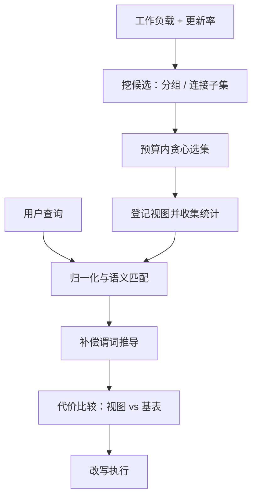

# 物化视图

物化视图是优化器的一次外置：把「这条查询会反复出现」的预测固化成存储。之后的每次命中都在为当初的预测收息，每次刷新都在付息。

<footer>—— 据 Gupta and Mumick；Zaharioudakis et al., 2000；Agrawal, Chaudhuri and Narasayya, 2000 整理</footer>

[上一课](/cs/qo-vectorized-deep)把执行摊到批上，让同一个计划跑得更快；物化视图换一条路——让计划根本不用跑。主干 [物化视图刷新](/cs/mv-refresh) 钉了维护合同，[星型模式](/cs/star-schema) 与 [OLAP cube](/cs/olap-cube) 给了典型聚合形状。本课补齐另两半：查询怎么被改写成用视图（匹配与补偿），以及该物化哪些视图（工作负载驱动的选择）。

## 问题

匹配的难点是查询与视图不逐字相同：查询比视图多一个过滤条件、列换了别名、外面又包了一层聚合。逐字匹配器只对上糖层，命中率低到没有工程价值。放行条件太松又危险：补偿谓词推导不完备，改写出的结果就是错的——错误的快比慢更贵。选择的难点是候选无限：每个分组维度组合、每种谓词组合都能成视图，而存储与刷新预算有限。

## 方法

匹配按强度分档。语法档：归一化后逐字对照，只能救缓存命中式的重复查询。语义档：把查询的选择—投影—连接结构映射进视图定义，证明视图包含查询所需元组集，把差出的谓词作为补偿条件叠在视图扫描上——例如视图没有地区过滤而查询有，就在视图上补一个 $\sigma_\mathrm{region}$。代价档：匹配成功不等于该用，「扫视图」与「扫基表」要放进同一个代价模型比较——第一课的接口在此再次出场。选择是离线任务：输入是带频率的工作负载与基表更新率；从负载里挖候选（常用的分组列子集、连接子集）；收益是节省代价乘频率、减去维护代价；预算约束下的选集是 NP-hard（与集合覆盖同族），工程用贪心：每轮加入边际收益最大的候选，数据库自带的自动顾问就是把这套跑成定期任务。

## 机制

匹配是改写不是提示（主干口径）：改写后的树仍走完整优化，因为视图可能比基表更歪或更陈旧。陈旧度要进匹配条件：延迟刷新的视图只服务接受陈旧的查询，可接受陈旧度是匹配器的输入——与刷新课的隔离语义绑死。视图自己也要收集统计：没统计的视图即使匹配上了也不敢用，代价无从比较。刷新代价进收益模型：高频更新的基表上建重聚合视图，利息可能收不回本金——这是把代价模型从「选计划」推广到「选存储」：物化决策与计划决策共用同一把尺子。

Oracle 的查询改写强度分档：ENFORCED 只信已验证的约束，TRUSTED 允许信任未验证的声明，STALE_TOLERATED 接受过期视图。分档的本质是用多少正确性证据换匹配率——它是运维旋钮，不是默认值。

## 边界

立即刷新的一致性代价与锁开销是事务接口，本课不展开；流式与连续物化归分析与流单元。手写汇总表没有定义，就没有匹配、没有维护合同——[反规范化](/cs/5nf-denormalization)课的警告在此重申。匹配器依赖声明而非猜测：UNIQUE、外键、函数依赖这些约束越全，可证明的包含关系越多——[索引选择](/cs/index-selection)课的「物理设计服务改写」在这里再延伸一层。

## 小结

- 匹配分语法、语义、代价三档；补偿谓词推导不完备就是错误结果。
- 选择是预算下的 NP-hard 选集；负载驱动加贪心是工程默认。
- 视图要统计、要陈旧预算；匹配成功后仍走完整优化。
- 收益减维护：物化是把代价模型推广到存储决策。
- 出处：Gupta and Mumick；Zaharioudakis et al., 2000；Agrawal, Chaudhuri and Narasayya, 2000。
