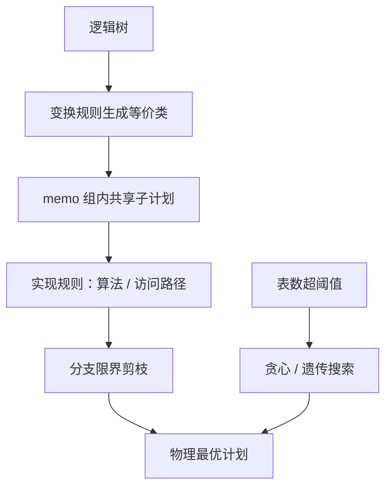
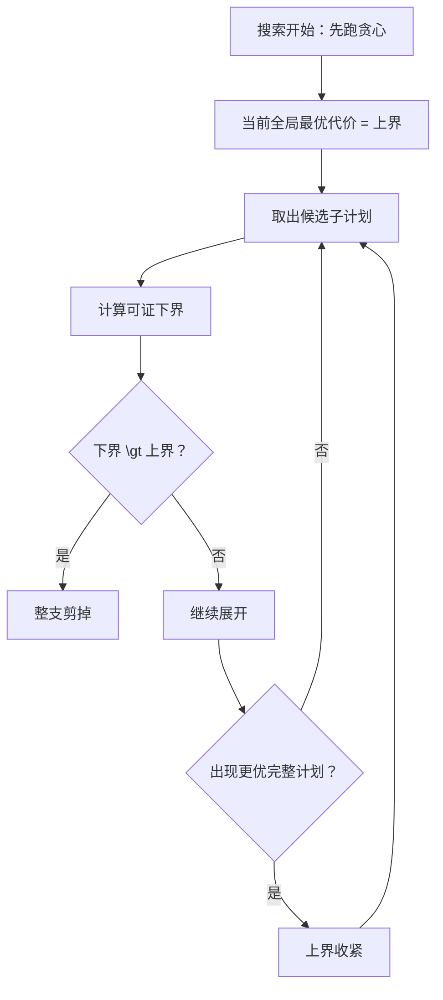

# 计划空间与枚举

空间不是被搜完的，是被扔完的；剪枝扔掉哪一类，哪一类就永远进不了候选——所以剪的依据必须比搜索本身更可靠。

<footer>—— 据 Graefe and McKenna, ICDE 1993；Vance and Maier, 1996；Moerkotte and Neumann, DPCCP 整理</footer>

[上一课](/cs/qo-statistics)把摘要子系统接好，枚举从此有了可信、也永远不够可信的输入。主干 [Selinger 动态规划](/cs/selinger-dp) 给了子集 DP 与有趣序，[连接顺序搜索空间](/cs/join-order-space) 画了左深、bushy 与连通限制。本课把「空间」当整体看：搜索的不只是连接顺序，算法选择、访问路径、并行度都挂在同一座 memo 上；枚举器的职责是组织等价计划，并安全地扔。

## 问题

空间是乘积。十张表的星型查询：左深排列约三百六十万，bushy 形状再乘上 Catalan 数到万亿量级；每个连接点还有哈希、归并、嵌套循环三种算法，每张表还有索引与堆两类访问路径。全部枚举不可能，于是两个问题：怎么组织，才不重复优化同一批等价子计划；怎么剪枝，才不把真最优扔掉。超时是常态而非异常：搜不完时交什么。

## 方法

memo 就是用「同一批等价子计划只存一份、只算一次」的手段来做「指数级空间去重」的事——可以把它想象成动态规划里的记忆化表格：键是子问题（等价类组），值是这个子问题当前已知的最好答案。memo 组织：把表达式收进等价类组，组内装多个逻辑与物理表达式；变换规则（交换、结合、下推）在逻辑层生成等价类，实现规则把逻辑表达式替换成物理算子。新算子只需声明自己的实现规则与代价函数——第一课立过的接口——枚举器与规则互不相认，这是 Volcano 到 Cascades 一系优化器的封装口径。共享：bushy 树的两个分支若到达同一组，只算一次。剪枝用分支限界：维护当前全局最好代价作上界；对候选子计划算一个**可证的下界**（例如只计不可避免的顺序读页数），下界超上界即整支剪掉。下界必须保守——掺了启发式的下界可能剪掉真最优。启发式档位：表数超阈值换贪心或遗传搜索（GOO、IKKBZ 一族）；任意时间算法保证任何时刻可返回当前最佳。

## 机制

有趣序在这里归位：它是组内表达式的输出性质之一，比较按「性质加代价」做支配判定，不是单独一套空间。代价模型的可加性在此兑现：组的物理最优代价回填后，父组直接复用，不再重算——memo 的省时正来自第一课的分解要求。超时策略有个工程顺序：先跑贪心拿一个上界，再进精确搜索，剪枝立刻变强；这比「先精确、超时再退启发式」更划算。基数错误的阴影仍在：空间组织得再对，输入错了还是选错树——统计课从下、误差传播课从上，把这条边界夹住。

数字实例：上界已到 $120$，某子计划的可证下界是 $135$——即使后面全部按最省方式补全，这支也至少要 $135$，比 $120$ 贵，整支扔掉不亏；但若下界掺了启发式、估成 $90$，真最优可能恰好藏在这支里被误剪。

初学者容易以为「先精确、超时再退启发式」更稳妥，实际上顺序反了：先跑贪心拿到一个够好的上界，精确搜索一进来就能大量剪枝，总时间往往更短——上界越紧，分支限界越锋利。

十表 bushy 形状数为 $\mathrm{Catalan}(9)\times 10!$，约 $1.8\times 10^{13}$；PostgreSQL 在表数超过 `geqo_threshold`（默认十二）时改走遗传算法 GEQO——「精确 DP 让位启发式」是写进默认配置的工程决定。

## 边界

外连接的交换与结合带条件，规则合法性是代数问题，本课不展开——[子查询去相关](/cs/subquery-decorrelation)课已见演算侧的防火墙。神经搜索不是主干：学习型优化器改变搜索的先验，不改变 memo 与剪枝的骨架。并行度作为计划维度引出 exchange，那是执行引擎课的地盘，本课只把它挂进空间。

## 小结

- 空间是逻辑等价类加物理实现规则的乘积，memo 负责共享与去重。
- 剪枝依据可证下界；掺启发式的下界可能剪掉真最优。
- 有趣序是支配判定的维度，不是另一套空间。
- 超阈值换启发式是工程默认；先贪心后精确优于先精确后超时。
- 出处：Graefe and McKenna, 1993；Vance and Maier, 1996；Moerkotte and Neumann。
