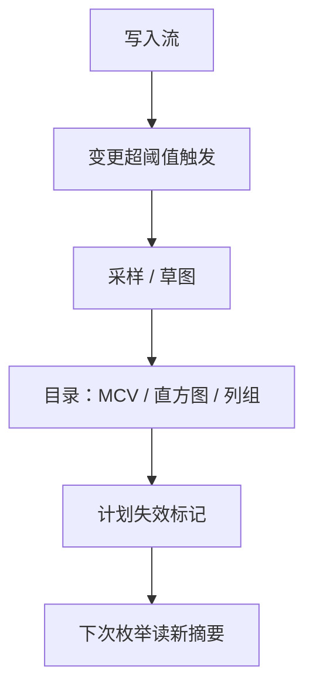

# 统计信息

优化器读的从来不是表，而是关于表的摘要；摘要过期，后面的枚举与实现只是在精致的错误上做选择。

<footer>—— 据 Poosala et al., 1996；Ioannidis and Christodoulakis, 1991；PostgreSQL 对 ANALYZE 的口径整理</footer>

[上一课](/cs/qo-join-implementation)把哈希连接的常数钉在缓存与倾斜上，但「哪侧当 build」仍由估计决定。主干 [基数估计误差传播](/cs/cardinality-error-propagation) 讲了误差怎么沿树放大，[采样与草图统计](/cs/db-sampling-sketches) 讲了摘要怎么采出来。本课把统计信息当一套要运维的子系统：目录里存什么、何时过期、谁来刷新、刷新怎么联动计划缓存。

## 问题

目录摘要通常包括：行数与页数、每列不同值个数、NULL 比例、最频繁值及其频率、[直方图](/cs/histogram-card)、列间相关性或函数依赖、部分表达式统计。麻烦有四类。漂移：摘要是快照，批量写入后立刻开始过期，而「过期了多少」对外不可见。相关：城市与邮编独立假设谎报选择率，单列直方图无能为力。分区：分区表各有局部统计，全局谓词要合并估计，分区裁剪又要局部值——两套都要，还不能互相撒谎。成本：收集本身是全表采样，不能每写一笔就跑。

## 方法

触发策略：变更行数超过阈值（常数加比例，如「50 行加表行数的十分之一」）触发自动收集；大表给更大容差，高频小表给更紧的目标。列组统计：对负载里反复出现的联合谓词维护联合不同值个数与联合最频繁值；函数依赖显式声明（邮编决定城市），优化器把两个条件当一条算。表达式统计：对 `date(ts)` 这类包装列建虚拟列统计，否则优化器对函数返回值的分布一无所知。分区口径：不同值个数用可合并草图——各分区一份合并成全局；直方图分区各自维护，全局估计用分位数合并。草图课讲过的可合并性在这里兑现。

## 机制

统计与计划缓存联动是硬要求：摘要刷新后，依赖旧摘要的计划要失效或标记再优化，否则新统计永远没有用户——[计划缓存](/cs/prepared-plan-cache)课已立此合同。收集在后台事务里跑，与用户写入隔离，代价要可限流；让统计刷新拖垮写负载是常见的运维事故。粒度是双刃：分区级统计准但贵且难合并，全局统计便宜但掩盖倾斜——热点分区的倾斜必须在局部统计里可见。低估仍是最危险的方向：下游连接会因此选错 build 侧、选嵌套循环去打大表，误差传播课已经算过这笔账。

PostgreSQL 默认统计目标是一百个桶；自动收集在变更超过「50 行加表行数的十分之一」时触发，可对单表单列收紧目标。这两个默认值解释了「批量导入后必须手动 ANALYZE」的常见经验。

## 边界

运行时的动态采样归自适应执行课；学习型基数估计是主干已点名的插件，不改变本课的存储与触发结构。直方图选择率的积分公式主干直方图课已给，本课不重推。统计的质量上限就是采样的质量：极低选择率谓词在样本里可能零命中，平滑与索引统计兜底——采样课的边界再次成立。

## 小结

- 摘要是快照：阈值触发的自动收集是工程底线，不是可选项。
- 相关列要列组统计或函数依赖；独立假设默认在说谎。
- 分区表局部与全局统计两套都要，草图负责合并。
- 刷新必须联动计划失效，否则新统计无人受益。
- 出处：Poosala et al., 1996；Ioannidis and Christodoulakis, 1991；PostgreSQL 文档。
