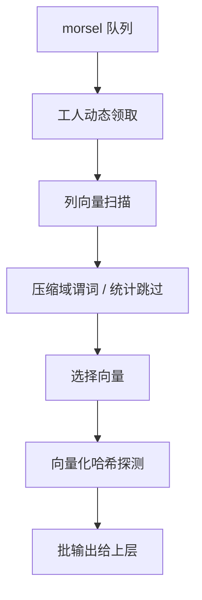

# 向量化执行的深入

向量化不是「用了 SIMD 就快」，而是把每次决策摊到一批数据上：分支、虚调用、访存未命中，每样按批摊薄；摊不动的部分，批越大越亏。

<footer>—— 据 Boncz, Zukowski and Nes, VLDB 2005；Leis et al., 2014；Kersten et al., PVLDB 2018 整理</footer>

[上一课](/cs/qo-adaptive-execution)把决策点沿执行流铺开。主干 [向量化执行](/cs/vectorized-execution) 钉了批粒度与选择向量，[编译执行](/cs/query-compilation) 钉了代码生成，[延迟物化](/cs/late-materialization) 钉了位置传递。本课深化三件事：宽度定多大、压缩数据上怎么直接算、多核下批从哪来，以及向量化与编译两条路线的混合。

## 问题

主干给了「几百到几千行」的量级，工程要定数。太窄，解释税回潮；太宽，活跃向量集合（输入列、选择向量、哈希键）超出一二级缓存，中间数据自己成了内存压力，分支预测与 TLB 也开始抖。第二个缺口是压缩数据：解压后再过滤等于白付带宽——字典、游程、分块统计明明支持不解压就跳过或判伪，存储课的编码不能只在读取时用一次。第三个缺口在多核：静态把批分给工人，倾斜或速率不齐时，先做完的工人干等，并行名存实亡。

## 方法

定宽：以「活跃向量的字节和落进一二级缓存」为准。例如宽 2048、每值八字节，一个列向量十六千字节，与一级缓存同量级；宽管道把活跃列数控制在个位数，多出的列按位置后取。压缩域执行：字典编码上先把谓词翻译成「码值谓词」——在字典项上比较，命中码集后再按位解压幸存行；游程段整段跳过或按段聚合；分块统计让整块数据不进 CPU（[zone map](/cs/zone-maps) 口径）。morsel 调度：把扫描切成比向量更小的 morsel 放进队列，工人动态领取——负载均衡的粒度与向量化解耦：morsel 管「谁做」，向量管「怎么做」，同一管道可叠加。

## 机制

与编译路线之争的对照口径：编译熔合算子、消灭调度，但生成代码膨胀，数据相关的分支在代码里仍是逐行判断；向量化保留解释结构、批摊开销，SIMD 显式可控。两者不互斥：编译生成批循环，或向量化内核按数据分布选专门化版本——后者正是上一课决策点谱系里的「算子内自适应」。代价模型跟着改口径：CPU 项拆成「每向量固定开销加每行变动开销」，否则第一课的悲剧重演，优化器与执行器各说各话。压缩域执行与[列压缩](/cs/column-compression)的编码选择是同一场谈判的两端：只有引擎认识的编码可短路，任意用户函数必须解压。

DuckDB 的标准向量宽是 2048——八字节列一个向量恰十六千字节；ClickHouse 走另一极端，索引粒度默认 8192 行、面向整段序贯扫描。同一个「批」字，宽度差一个量级，管道形态完全不同。

## 边界

GPU 与协处理器不进本课。OLTP 窄行短查询批摊税不划算，主干已钉；本课的领域仍是分析型长管道。压缩域执行的上限是编码的表达力：复杂谓词最终仍要解压兜底，短路是优化不是语义——改写结果必须与解压后逐行求值同指称。

## 小结

- 宽度由活跃向量的缓存驻留决定，两千上下是常见落点。
- 压缩域执行先算码值谓词再解压幸存行，带宽留在存储层。
- morsel 管负载均衡，向量管指令效率，两者正交可叠加。
- 向量化与编译不互斥；代价模型的 CPU 项要按批重写。
- 出处：Boncz, Zukowski and Nes, 2005；Leis et al., 2014；Kersten et al., 2018。
