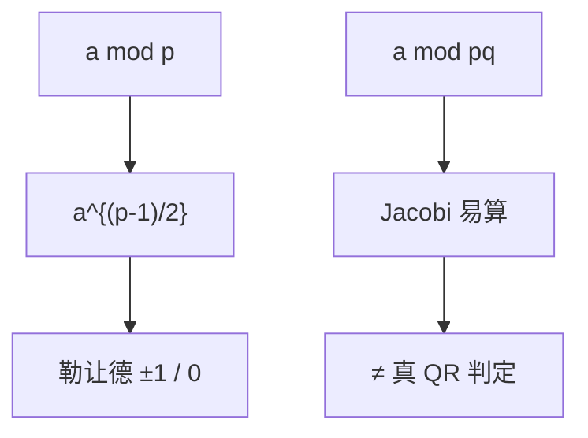

# 二次剩余

模 $p$ 的平方剩余由勒让德符号判定，欧拉准则 $a^{(p-1)/2}\equiv\pm 1$；模 $n=pq$ 的二次剩余判定与分解一样硬，这是若干比特承诺的老家。

<footer>—— 据 Gauss；Ireland and Rosen 整理</footer>

上一课[离散对数](/cs/generator-discrete-log) 是指数。缺口是**平方**：哪些 $a$ 有 $x^2\equiv a\pmod p$。勒让德 $(\frac{a}{p})$，二次互反律用来算。模合数 $n$ 的 Jacobi 可多项式计算，却不回答是否真平方——Goldwasser–Micali 等协议吃这一缝。本课不写协议。

## 问题

$\mathbb{F}_p^\times$ 循环，平方恰一半元素。欧拉：$a^{(p-1)/2}\equiv(\frac{a}{p})\pmod p$。Tonelli–Shanks 在 $p\bmod 4$ 等条件下开方。模 $n=pq$：若知 $p,q$ 可 CRT 开方；不知则 QR 判定等价某些困难假设。Jacobi $(\frac{a}{n})$ 把勒让德乘起来，可多项式算，但对 QR 有假阳性。

不要把「平方根模 $n$」写成 OWF 的唯一例子：它与分解等价（Rabin）。点名。

### Jacobi 不是勒让德

$(\frac{a}{n})=1$ 仍可能非剩余。写程序时用 Jacobi 当「是否平方」会错。

Gauss 二次互反。Ireland–Rosen 第 5–6 章。Cipolla、Tonelli–Shanks 开方。本课要判别与合数缝隙，不证互反律。

## 方法

在模 $11$ 列出平方表，核对欧拉准则。指出互反律把 $(\frac{p}{q})$ 换成 $(\frac{q}{p})$ 带符号，便于手算。对照 Miller–Rabin：那里用 $a^{(n-1)/2}$ 一类当见证，下一课。

## 机制

QR 给「比特藏在剩余/非剩余」的经典承诺。后课格密码不再依赖 QR。素性测试用相关的幂，但见证选择不同。本课把平方这一层钉在 DLP 与素性之间。

二次互反：$(\frac{p}{q})(\frac{q}{p})=(-1)^{(p-1)(q-1)/4}$（奇素数）。手算勒让德靠它。Tonelli–Shanks 在素数域开方多项式。Rabin 加密：平方模 $n$，解密开方，与分解等价。GM 承诺用模 $n$ 的 QR 藏一比特，本课不写协议。

## 边界

本课不证二次互反，不引入高次剩余。不写 Goldwasser–Micali 加密。后课默认：模 $p$ 的 QR 易判；模 $pq$ 的真 QR 难。下一课 Miller–Rabin。

模 $p$ 的 QR 易判、可开方；模 $pq$ 的真 QR 与分解同级难，Jacobi 却好算——缝隙是承诺方案的老家。欧拉准则的平方链形状，下一课变成 Miller–Rabin 见证。

上一课留下的缺口在本课收口；「二次剩余」进入后课词汇表后只引用。文献用来钉对象与边界，不把本课写成该主题的独立综述。

## 小结

- 模 $p$：一半平方；欧拉准则给勒让德。
- 模 $pq$：Jacobi 易、真 QR 难；开方与分解等价。
- Jacobi $=1$ 不是剩余的充要条件。
- 出处：Gauss；Ireland and Rosen。
